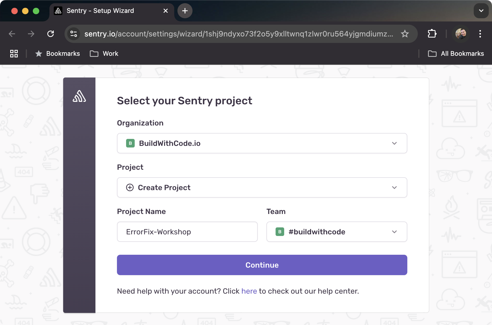
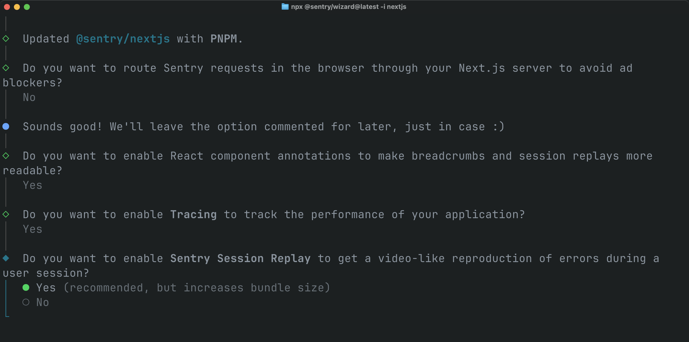
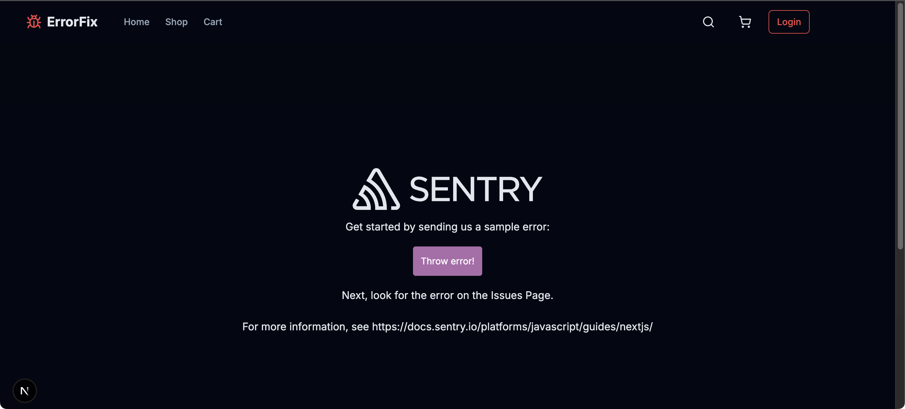
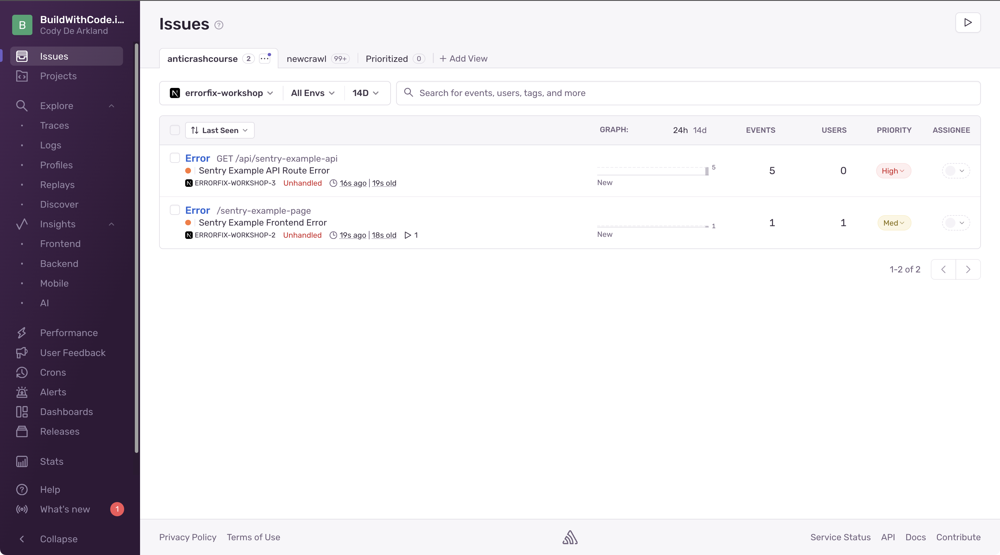

Let's face it—your code is going to break. It happens to all of us. The question is: how fast can you fix it when it does? In this section, we'll add Sentry to our Next.js application so we can catch those errors in the wild before our users start tweeting about them.

## Quick Setup with Sentry CLI

Let's get Sentry integrated with our ErrorFix application quickly:

```bash
npx @sentry/wizard@latest -i nextjs
```

This wizard will:
1. Connect to your Sentry account
2. Set up configuration files
3. Create an example error page to test your setup

## Following the Wizard

When you run the command, you'll see a series of prompts:

1. **Authentication**: Choose between browser login (easiest) or an auth token
   - If you don't have a token handy, just go with the browser option
   - The wizard will open your browser and let you log in to Sentry

2. **Project Selection**: Choose your Sentry project

   

   - If you don't have one yet, the wizard can create it for you
   - Select "Next.js" as the platform

3. **Feature Selection**: You'll be asked which features to enable:

   

   - **Error Monitoring**: Enable to catch runtime errors
   - **Performance Monitoring**: Enable to track app performance
   - **Session Replay**: Enable to see visual recreations of user sessions

<details>
<summary>Learn More: Error Monitoring</summary>

Error monitoring is the core functionality of Sentry. It allows you to:

- Capture unhandled exceptions in real-time
- See detailed stack traces
- Get context about the user and environment
- Track error frequency and impact
- Assign errors to team members for resolution

When an error occurs, Sentry will show you:
- The exact line of code that failed
- What function was being executed
- The sequence of function calls leading to the error
- What browser/device the user was using
- Custom context you've added to your app

This is essential for quickly identifying and fixing critical issues before they affect more users.
</details>

<details>
<summary>Learn More: Performance Monitoring</summary>

Performance monitoring helps you track how your application performs for real users:

- Track page load times
- Monitor API call durations
- Identify slow database queries
- See frontend rendering performance
- Set performance thresholds and alerts

Sentry's performance monitoring creates "transactions" for each significant operation in your app. Each transaction contains "spans" representing smaller operations within it.

This allows you to:
- See which parts of your application are running slowly
- Track performance over time
- Compare performance across different pages and features
- Identify performance regressions after deployments
- Correlate performance issues with errors

By monitoring performance, you can ensure your application not only works but works efficiently.
</details>

<details>
<summary>Learn More: Session Replay</summary>

Session Replay is like having a video recording of what your users experienced:

- Watch recreations of user sessions leading up to errors
- See exactly what users saw and did
- Identify UI/UX issues that lead to confusion
- Understand complex user interactions that trigger bugs
- Reproduce hard-to-track errors

Session Replay captures:
- DOM changes
- User interactions (clicks, scrolls, form inputs)
- Console logs
- Network requests

Privacy features ensure sensitive data isn't captured:
- Automatic PII masking
- Customizable privacy rules
- Consent-based recording

This feature dramatically reduces time spent trying to reproduce issues, especially those that depend on specific user interactions or state sequences.
</details>

## What the Wizard Adds to Your Project

The wizard configures your application with several important files:

1. **Configuration Files for Every Environment**:
   - `sentry.client.config.js` - For browser errors
   - `sentry.server.config.js` - For server-side rendering/API routes
   - `sentry.edge.config.js` - For edge functions

   Here's what the client configuration looks like:

   ```javascript
   // sentry.client.config.js
   import * as Sentry from '@sentry/nextjs';

   Sentry.init({
     dsn: "https://your-public-dsn@o0.ingest.sentry.io/0",
     
     // Capture all errors in development
     tracesSampleRate: 1.0,
     
     // Record 10% of normal sessions, but all error sessions
     replaysSessionSampleRate: 0.1,
     replaysOnErrorSampleRate: 1.0,
     
     // Session replay is only available in the browser
     integrations: [Sentry.replayIntegration()],
   });
   ```

2. **Updated Next.js Configuration**:
   - Adds Sentry's webpack plugin to `next.config.js`
   - Configures source map uploads
   - Sets up error handling middleware

   ```javascript
   // next.config.js
   const { withSentryConfig } = require('@sentry/nextjs');

   const nextConfig = {
     // Your existing config stays here
   };

   module.exports = withSentryConfig(
     nextConfig,
     {
       silent: true, // Less console noise during builds
       org: "your-organization",
       project: "your-project",

       reactComponentAnnotation: {
        enabled: true,
       },
     }
   );
   ```

3. **App Router Instrumentation**:
   - Creates/updates `instrumentation.ts` for App Router support

   ```typescript
   // instrumentation.ts
   export async function register() {
     if (process.env.NEXT_RUNTIME === "nodejs") {
       await import("./sentry.server.config");
     }

     if (process.env.NEXT_RUNTIME === "edge") {
       await import("./sentry.edge.config");
     }
   }
   ```

4. **Example Error Page**:
   - Adds `/sentry-example-page` to test different error scenarios

## Testing Your Sentry Setup

Now let's verify everything is working:

1. Start your Next.js app:

```bash
npm run dev
```

2. Visit the example page created by the wizard (typically `/sentry-example-page`)

   

3. Click the different error button to generate test errors:

4. Check your Sentry dashboard at [sentry.io](https://sentry.io)

   

   - You should see your errors appearing in real-time
   - Click on an error to see detailed information

## Troubleshooting

If you're not seeing errors in your Sentry dashboard:

- **Check your DSN**: Verify the DSN in your Sentry config files
- **Sample rate**: Confirm your `tracesSampleRate` isn't set too low

## What You've Accomplished

You've now:
1. Set up Sentry to monitor your Next.js application
2. Configured it to capture client, server, and edge runtime errors
3. Verified the setup by generating test errors
4. Can now see detailed error information in your Sentry dashboard

## Next Steps

Now that we have Sentry catching errors, let's move to [Instrumenting Errors](/instrumenting-errors/) where we'll learn how to actively instrument our code with try/catch blocks and Sentry's error capturing functions to get even more context about what's going wrong in our application. 