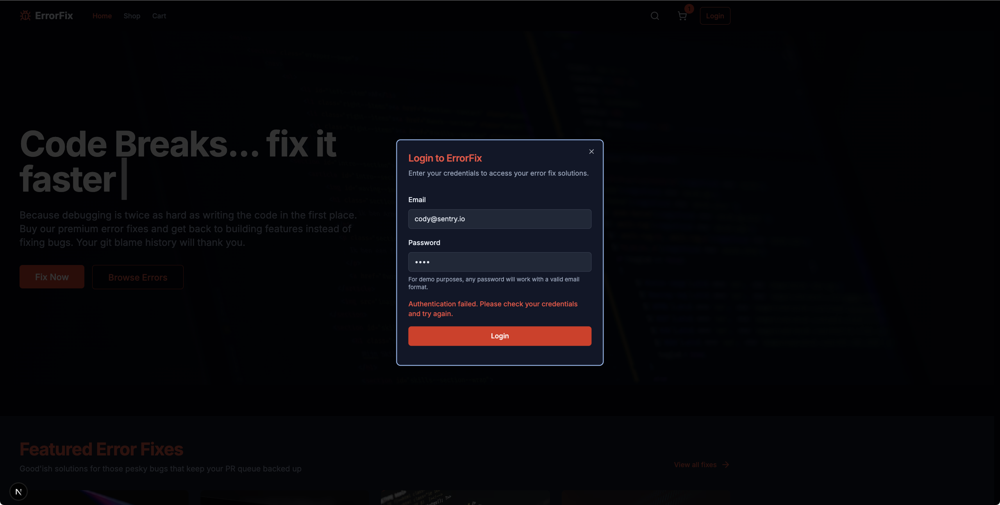
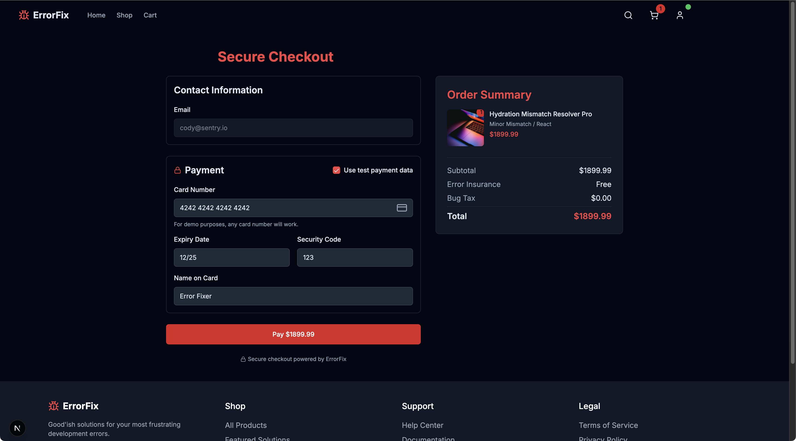

So we've got Sentry installed now; great. Let's get set up to properly capture errors. We're jumping right into the code! 

## Houston, We Have Several Problems

Picture this: You visit ErrorFix's marketplace, eager to solve some costly errors (oh, the irony), and... *tumbleweeds*. The product list is emptier than a developer's coffee cup at 4 PM. You click the heroic "Fix Me" button, hoping for salvation, and... *loading spinner of doom*. Then? Nothing. Nada. Zip.


Something's clearly wrong with our product system, but right now we're debugging blind. It's like trying to find a missing semicolon in the dark. 

## Understanding Sentry's Exception Capture

When errors occur in your application, you need more than just a console log. Sentry's exception capture provides rich context that helps you understand what went wrong and how to fix it.

## The Case of the Missing Products

Our ErrorFix app has several major crime scenes we need to investigate:

1. **The Ghost Town Marketplace** - Where products should be, but aren't
2. **The Infinite Loading Loop of Doom** - When clicking product links leads to... nowhere
3. **The Authentication Confusion** - When login attempts fail mysteriously
4. **The Payment Predicament** - When checkout process breaks down

Time to add some error tracking and figure out what's actually going wrong. The simplest way to capture an error with Sentry is using the `Sentry.captureException(error)` method:

```javascript
Sentry.captureException(error);
```

This method captures the error and sends it to Sentry, where it can be analyzed and reported.

Let's dive into each issue one by one in the following sections.

## Issue 1: The Products API Investigation

Lets start by exploring the error in our Products API. Open the Sentry issue for this one and explore the details. 


Within this issue, you'll be able to see: 

* Details on the error
* A stack trace for the code
* Important debugging context information like browser, user, and environment details
* Repkays (when available)
* Traces and Span's related to your issue
* And root cause and resolution information from Sentry's AI product Seer (Autofix)

We can use this information to help fix the issue.

Let's open `/api/products/route.ts`. In here, we're going to modify our `catch` block to capture the error with Sentry using the `Sentry.captureException(error)` method, **Uncomment line 4 to enable the import of Sentry, and uncomment the `Sentry.captureException(error)` line to enable the error capture**:

```javascript
// this is line 4
// import * as Sentry from '@sentry/nextjs';
// ...
} catch (error) {
    console.error('Error in products API route:', error);

    // SENTRY-THIS: Cathing your exceptions!
    // Sentry.captureException(error);

    return NextResponse.json(
// ...
```

With that uncommented, we'll get high fiedlity error reports in Sentry for failures on this route. This includes the error message, stack trace, and other useful information.


### Resolving Issue 1 - Problems in the Products API

Using Sentry, theres a few things we can quickly find out:

* Details on the error message that was thrown - `relation "product" does not exist`
* This is happening on a GET call, in the /api/products route
* Seer (AutoFix) is telling us that the "product" relation doesn't exist; which is a database error 
* Our replay shows exactly where the error is happening matching our breadcrumbs 
* We can see a our traces and spans that show the failing communication in the route

We can explore the Span for our database call, which is automatically instrumented, and see the query that was used. 


Wen we explore the `schema.ts` file in the code, we can see the table is actually called `products` and not `product`. Someone clearly didn't check carefully before writing their query. 

This is why you should use the Drizzle native query builder, and not just write raw SQL. Oh Well. Technical debt is rough. 

We can fix this by updating the query to use the correct table name. In the `/api/products/route.ts` file, update this line:

```javascript
const result = await db.execute(sql`SELECT * FROM "product"`);
```

to this: 

```javascript
const result = await db.execute(sql`SELECT * FROM "products"`);
```

Save your file and reload your browser... looks like we're starting to get back into business! 


## Issue 2: "Fix Me" Button is Decided Not Working

When we click the "Fix Me" button, We're greeted with a sad state of the world. 


Open up the error in Sentry, and we can explore the details.


Just like before, we can explore the Sentry Issue to get details on the error and context around how to solve it. We're seeing similar suggestions from Sentry Seer on the root cause.

### Resolving Issue 2 - "Fix Me" Getting Fixed Up

What are the odds that the same syntax issue happened in another route? Pretty high we'd bet. 

In code, navigate to the `/app/api/products/[id]/route.ts` file. To help safeguard us from problems in the future, lets 

This is the route that's supposed to handle individual product details but is currently handling... well, disappointment. **We're going to uncomment the Sentry lines to enable the error capture**:

```javascript
import { initDb } from '@/lib/db/db-server';
// this is line 4
// import * as Sentry from '@sentry/nextjs';
import { products } from '@/lib/data';

// ...
} catch (error) {
    console.error(`API error for product ${id}:`, error);
    
    // SENTRY-THIS: Cathing your exceptions!
    // Sentry.captureException(error);

    // Return standardized error response with more details
    return NextResponse.json(
// ...
```

This gives us our better fidelity errors, but while we're here, let's also fix the database call. Replace this line:

```javascript
    const result = await db.execute(sql`SELECT * FROM "product" WHERE id = ${numId}`);
```

with this: 

```javascript
const result = await db.execute(sql`SELECT * FROM "products" WHERE id = ${numId}`);
```

Save your file, reload the browser, and click on the "Fix Me" button. 


Looks like our store's product lists are back in business! Let's add it to the cart, and test our check out flow. 

When we try to check out, we're greeted with a login screen; and when we try to login - it's more sadness. 



## Issue 3: The Mystery of the Bad Auth Matchy-Matchy

Auth is always a fun one to debug. In this case, we'll use Sentry's Tracing and Span's to help us understand what's going on. Sentry instruments many out of the box span configurations by default, but there when you want custom values and easier searchability - Custom Spans are a great option. 

Open up `/app/lib/store.ts` and replace the entire login call with the below code.

```javascript
// top of the file 
import * as Sentry from '@sentry/nextjs';


// replace login section with this
login: async (email: string, password: string) => {
  try {
    return await Sentry.startSpan(
      {
        name: "Login Request",
        op: "auth.login",
        attributes: {
          "authHeader.property": AUTH_CONFIG.authHeaderName,
          "auth.method": "password",
          "email.domain": email.split('@')[1] || 'unknown'
        }
      },
      async (span) => {
        // First validate the email format
        const emailRegex = /^[^\s@]+@[^\s@]+\.[^\s@]+$/;
        if (!emailRegex.test(email)) {
          span.setAttributes({
            "validation.error": "invalid_email_format",
            "request.success": false
          });
          
          return { 
            success: false, 
            error: 'Invalid email format. Please try again.' 
          };
        }
        
        const response = await fetch('/api/auth/login', {
          method: 'POST',
          headers: {
            'Content-Type': 'application/json',
            [AUTH_CONFIG.authHeaderName]: 'Bearer ' + btoa(`${email}:${password}`)
          },
          body: JSON.stringify({ email, password }),
        });
        
        // Set span attributes with response info
        span.setAttributes({
          "http.status_code": response.status,
          "request.success": response.ok
        });
        
        if (!response.ok) {
          // Capture the API error with Sentry
          Sentry.captureMessage(`Login API error: ${response.statusText}`, {
            level: "error",
            tags: {
              errorType: "login_error",
              errorCode: response.status.toString(),
              httpStatus: response.status,
              authHeaderUsed: AUTH_CONFIG.authHeaderName
            }
          });
          
          // Generic error message that doesn't reveal the actual issue
          return { 
            success: false, 
            error: 'Authentication failed. Please check your credentials and try again.' 
          };
        }
        
        const data = await response.json();
        
        if (data.user) {
          span.setAttributes({
            "auth.success": true,
            "user.id": data.user.id
          });
          
          set({ user: data.user, isAuthenticated: true });
          return { success: true };
        } else {
          span.setAttributes({
            "auth.success": false,
            "error.reason": "invalid_credentials"
          });
          
          return { 
            success: false, 
            error: 'Invalid credentials. Please try again.' 
          };
        }
      }
    );
  } catch (error) {
    console.error('Login error:', error);
    
    // Capture the exception with Sentry
    Sentry.captureException(error, {
      tags: {
        errorType: "login_error",
        errorSubtype: "client_exception"
      },
      extra: {
        authConfig: AUTH_CONFIG
      }
    });
    
    // Generic error message that doesn't reveal the actual issue
    return { 
      success: false, 
      error: 'An error occurred during login. Please try again later.' 
    };
  }
},
```

We also need to do the same on our server-side code in `/app/api/auth/login/route.ts`

```javascript
// top of the file 
import * as Sentry from '@sentry/nextjs';

// replace the POST section with this
export async function POST(request: Request) {
  try {
    return await Sentry.startSpan(
      {
        name: "Login API Request",
        op: "errorfix.login.api",
        attributes: {
          "authHeaderExpected.property": SERVER_AUTH_CONFIG.expectedAuthHeaderName,
          "http.method": "POST",
          "http.route": "/api/auth/login"
        }
      },
      async (span) => {
        const allHeaders = Object.fromEntries(request.headers.entries());
        const authHeader = request.headers.get(SERVER_AUTH_CONFIG.expectedAuthHeaderName);
        
        const wrongAuthHeader = request.headers.get('Authentication');
        
        span.setAttributes({
          "auth.header.present": !!authHeader,
          "auth.wrong_header.present": !!wrongAuthHeader,
          "auth.all_headers": JSON.stringify(allHeaders)
        });
        
        if (!authHeader && wrongAuthHeader) {

          Sentry.captureException(new Error("Authentication header mismatch"), {
            tags: {
              errorType: "auth_error",
              errorSubtype: "header_name_mismatch",
              expectedHeader: SERVER_AUTH_CONFIG.expectedAuthHeaderName,
              receivedHeader: "Authentication"
            },
            extra: {
              headers: allHeaders,
              endpoint: "/api/auth/login"
            }
          });
          
          return NextResponse.json(
            { 
              error: 'Authentication failed',
              message: 'Invalid authentication credentials',
              code: 'AUTH_FAILED'
            },
            { status: 401 }
          );
        }
        
        const body = await request.json();
        const { email, password } = body;
        
        const emailRegex = /^[^\s@]+@[^\s@]+\.[^\s@]+$/;
        if (!emailRegex.test(email)) {
          return NextResponse.json(
            { 
              error: 'Invalid email format',
              message: 'Please provide a valid email address',
              code: 'INVALID_EMAIL'
            },
            { status: 400 }
          );
        }

        let userId;
        
        switch (SERVER_AUTH_CONFIG.idGenerationMethod) {
          case 'standard':
            userId = Math.random().toString(36).substring(2, 15);
            break;
          case 'legacy':
            userId = `legacy-${Math.random().toString(36).substring(2, 5)}`;
            break;
          case 'uuid':
            userId = `${Date.now()}-${Math.random().toString(36).substring(2, 7)}`;
            break;
          default:
            userId = `user-${Math.random().toString(36).substring(2, 10)}`;
        }
        
        span.setAttributes({
          "auth.success": true,
          "user.id": userId
        });
        
        const user = {
          id: userId,
          email,
          name: email.split('@')[0],
        };
        
        return NextResponse.json({ user });
      }
    );
  } catch (error) {
    console.error('Login API error:', error);
    
    Sentry.captureException(error, {
      tags: {
        errorType: "auth_error",
        errorSubtype: "login_exception"
      },
      extra: {
        endpoint: "/api/auth/login",
        requestTime: new Date().toISOString()
      }
    });
    
    return NextResponse.json(
      { 
        error: 'Authentication failed',
        message: 'An error occurred during the authentication process',
        code: 'AUTH_ERROR'
      },
      { status: 500 }
    );
  }
}
```

With these in place, we can reload our application, and try our login flow again. We'll receiove an error as expected, but now we'll have more information to work with on where the failure is happening. 

### Enter Trace Explorer

When we return to Sentry, we can select the "Traces" tab to explore the spans and get more information on what went wrong. This view lets us search for spans based on attributes, and see their results. 

On the search bar, type in "Login" and hit enter. You may need to ensure your filters are set correctly.


We'll see our Spans in the results for the login operations, and if we had a higher volume, you could change the views and aggregation options for the data. 

We can dive into our `Login API Request` span, and expand the problem sections to see more details on whats going on.


In the span attribute properties on the right, we can see we're receiving an "Authentication header Mimatch" error. 

### Resolving Issue 3 - Authentication Header Mismatch

Debugging the authentication header mismatch is much easier using the combination of Sentry issue tracking and tracing. With issues we get details on the error and context around the user interaction, and Tracing lets us see the request flow. 

If we look at our server side API at `/app/api/auth/login/route.ts`, we can see it expects an `Authorizaton` header, however when we look at `/app/lib/store.ts` we see it's using `Authentication` instead. 

We can update the `Authentication` header to `Authorization` in the `/app/lib/store.ts` file to fix this issue. 

There's `AUTH_CONFIG` object that contains the header name, and we can update that to use the correct property. 

Change this section:

```javascript
const AUTH_CONFIG = {
  authHeaderName: 'Authentication', 
  tokenPrefix: 'Bearer'
};
```
To this: 

```javascript
const AUTH_CONFIG = {
  authHeaderName: 'Authorization', 
  tokenPrefix: 'Bearer'
};
```

Save and update the file, reload the page, and try the login again. We should see our checkout form! 



Now, finally, everything has to be fixed. Let's click `Use test payment data` and... it's broken too. 

Whoever built this needs to step away from the keyboard. 


## Issue 4: The Final Chapter - Fixing the "Gimme Money" button

We can tell that our client side is working correctly; because items are being successfully added to the shopping cart when we add them.

We could add a ton of `console.log()` statements to try and figure out how data is moving across, but we've picked up some new tricks on our journey that are a lot more interesting. 

On the Client side, we'll instrument Breadcrumbs to help us track the interactions within our page, we'll also instrument a Custom Span like we did in the previous lesson to track what properties are being sent. 

Server side, we'll create a span that will track the incoming data, and help us compare the values. 


### Client-Side Setup 

We'll start with our Breadcrumbs. Open up `/app/checkout/page.tsx` file, and we will bring in the Sentry configuration for the custom breadcumb. 

Find the `handleSubmit` funciton, and palce this breadcrumb before the `makePurchase` call. 

```javascript
// top of the file 
import * as Sentry from '@sentry/nextjs';

// Inside handleSubmit function, before makePurchase call
Sentry.addBreadcrumb({
  category: 'checkout',
  message: `Attempting checkout with ${items.length} items`,
  level: 'info',
  data: {
    itemCount: items.length,
    itemDetails: items.map(item => ({ id: item.id, name: item.name, price: item.price })),
    totalAmount: totalPrice
  }
});
```

This breadcrumb will add additional tracking when the user interacts with the component. It will track the individual items in the cart, the total price, and the number of items. 

Next, we'll instrument a custom span to track the properties being sent to the server. 

Head to `/app/lib/store.ts` and find the `makePurchase` call. This is the call that actually sents our interaction to the server. We'll use a span here to track the outgoing request and its contents.

Replace the entire `makePurchase` call with this:

```javascript
// top of the file 
import * as Sentry from '@sentry/nextjs';

makePurchase: async (paymentDetails: { items: Array<{ id: string; price: number; name: string }>; totalAmount: number }) => {
  set({ processingPurchase: true, purchaseError: null });
  
  return await Sentry.startSpan(
    {
      name: "Client Purchase Request",
      op: "purchase.client",
      attributes: {
        "cart.items.count": paymentDetails.items.length,
        "cart.total_amount": paymentDetails.totalAmount,
        "cart.items": JSON.stringify(paymentDetails.items.map(item => ({ id: item.id, name: item.name, price: item.price })))
      }
    },
    async () => {
      try {
        const authState = useAuthStore.getState();
        
        const response = await fetch('/api/checkout/purchase', {
          method: 'POST',
          headers: {
            'Content-Type': 'application/json',
            ...(authState.isAuthenticated && authState.user 
              ? { [AUTH_CONFIG.authHeaderName]: `${AUTH_CONFIG.tokenPrefix} ${authState.user.id}` } 
              : {})
          },
          body: JSON.stringify(paymentDetails),
        });
      
        const data = await response.json();
        
        if (!response.ok) {
          throw new Error(data.message || 'An error occurred during checkout.');
        }
        
        set({ 
          processingPurchase: false, 
          purchaseComplete: true 
        });
        
        return { success: true };
      } catch (error: any) {
        console.error('Purchase error:', error);
        set({ 
          processingPurchase: false,
          purchaseError: error.message || 'Payment processing failed'
        });
        
        return { 
          success: false, 
          error: error.message || 'Payment processing failed. Please try again.' 
        };
      }
    }
  );
},
```

This covers our client-side setup; to complete the flow, we'll need to update our server-side code to capture the incoming request and its contents. 

### Server-Side Setup 

Open up `/app/api/checkout/purchase/route.ts` and we'll add a span to capture the incoming request. 

Replace the contents of the POST call with This

```javascript
// top of the file 
import * as Sentry from '@sentry/nextjs';

// replace the POST section with this
export async function POST(request: Request) {
  return Sentry.startSpan(
    {
      name: "Server Purchase Processing",
      op: "purchase.server",
    },
    async () => {
      try {
        const body = await request.json();
        
        // Extract cart data from request body
        const { items: cartContents, paymentDetails, totalAmount } = body;
        
        // Add span attributes to track the values
        Sentry.setSpanAttribute("cart.raw_body", JSON.stringify(body));
        Sentry.setSpanAttribute("cart.has_items_property", body.hasOwnProperty('items'));
        Sentry.setSpanAttribute("cart.items_value", body.items ? JSON.stringify(body.items) : "undefined");
        Sentry.setSpanAttribute("cart.received_items", cartContents ? JSON.stringify(cartContents) : "undefined");
        Sentry.setSpanAttribute("cart.received_items_count", cartContents ? (Array.isArray(cartContents) ? cartContents.length : 0) : 0);
        Sentry.setSpanAttribute("cart.total_amount", totalAmount);
        
        // Check auth header (simplified, no token validation)
        const authHeader = request.headers.get('Authorization');
        if (!authHeader || !authHeader.startsWith('Bearer ')) {
          Sentry.setSpanAttribute("auth.error", "missing_or_invalid_auth_header");
          
          return NextResponse.json(
            { 
              error: 'Authentication required',
              message: 'You must provide a valid authentication token',
              code: 'AUTH_REQUIRED'
            },
            { status: 401 }
          );
        }
        
        if (!cartContents || !Array.isArray(cartContents) || cartContents.length === 0) {
          Sentry.setSpanAttribute("cart.error", "empty_cart");
          Sentry.setSpanAttribute("cart.validation_details", JSON.stringify({
            cartContents_exists: !!cartContents,
            isArray: Array.isArray(cartContents),
            length: cartContents ? cartContents.length : 0
          }));
          
          return NextResponse.json(
            { 
              error: 'No items in cart',
              message: 'Your cart is empty. Please add items before checkout',
              code: 'EMPTY_CART'
            },
            { status: 400 }
          );
        }
          
        // Simulate payment processing time
        await new Promise(resolve => setTimeout(resolve, 1500));
        
        const transactionId = Math.random().toString(36).substring(2, 15);
        Sentry.setSpanAttribute("transaction.id", transactionId);
        Sentry.setSpanAttribute("transaction.amount", totalAmount);
        Sentry.setSpanAttribute("transaction.item_count", cartContents.length);
        
        return NextResponse.json({
          success: true,
          transactionId,
          timestamp: new Date().toISOString(),
          amount: totalAmount,
          itemCount: cartContents.length
        });
      } catch (error) {
        console.error('Purchase API error:', error);
        Sentry.captureException(error);
        
        return NextResponse.json(
          { 
            error: 'Payment processing failed',
            message: 'An error occurred while processing your payment',
            details: process.env.NODE_ENV === 'development' ? String(error) : undefined,
            code: 'PAYMENT_ERROR'
          },
          { status: 500 }
        );
      }
    }
  );
}
```

With these in place, reload our application and try the checkout flow again. Once it fails, we can head into sentry and check out our results. 


