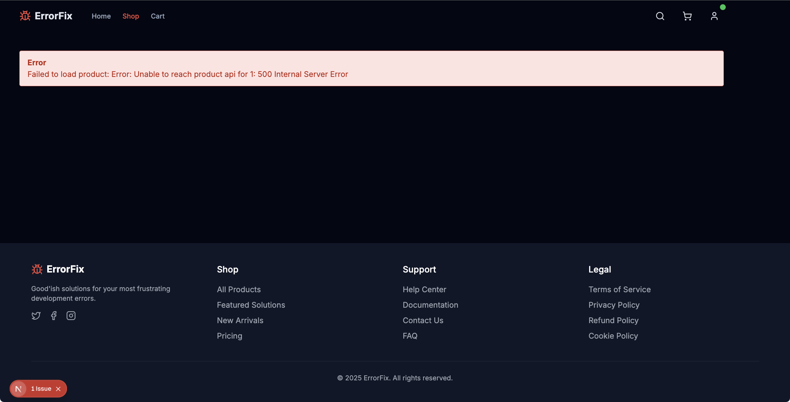

When we click the "Fix Me" button, We're greeted with a sad state of the world. 



Open up the error in Sentry, and we can explore the details.


Just like before, we can explore the Sentry Issue to get details on the error and context around how to solve it. We're seeing similar suggestions from Sentry Seer on the root cause.

## Resolving Issue 2 - "Fix Me" Getting Fixed Up

What are the odds that the same syntax issue happened in another route? Pretty high we'd bet. 

In code, navigate to the `/app/api/products/[id]/route.ts` file. To help safeguard us from problems in the future, let's add some error tracking.

This is the route that's supposed to handle individual product details but is currently handling... well, disappointment. **We're going to uncomment the Sentry lines to enable the error capture**:

```javascript
import { initDb } from '@/lib/db/db-server';
// this is line 4
// import * as Sentry from '@sentry/nextjs';
import { products } from '@/lib/data';

// ...
} catch (error) {
    console.error(`API error for product ${id}:`, error);
    
    // SENTRY-THIS: Cathing your exceptions!
    // Sentry.captureException(error);

    // Return standardized error response with more details
    return NextResponse.json(
// ...
```

This gives us our better fidelity errors, but while we're here, let's also fix the database call. Replace this line:

```javascript
const result = await db.execute(sql`SELECT * FROM "product" WHERE id = ${numId}`);
```

with this: 

```javascript
const result = await db.execute(sql`SELECT * FROM "products" WHERE id = ${numId}`);
```

Save your file, reload the browser, and click on the "Fix Me" button. 


Looks like our store's product lists are back in business! Let's add it to the cart, and test our check out flow. 

When we try to check out, we're greeted with a login screen; and when we try to login - it's more sadness. 

 