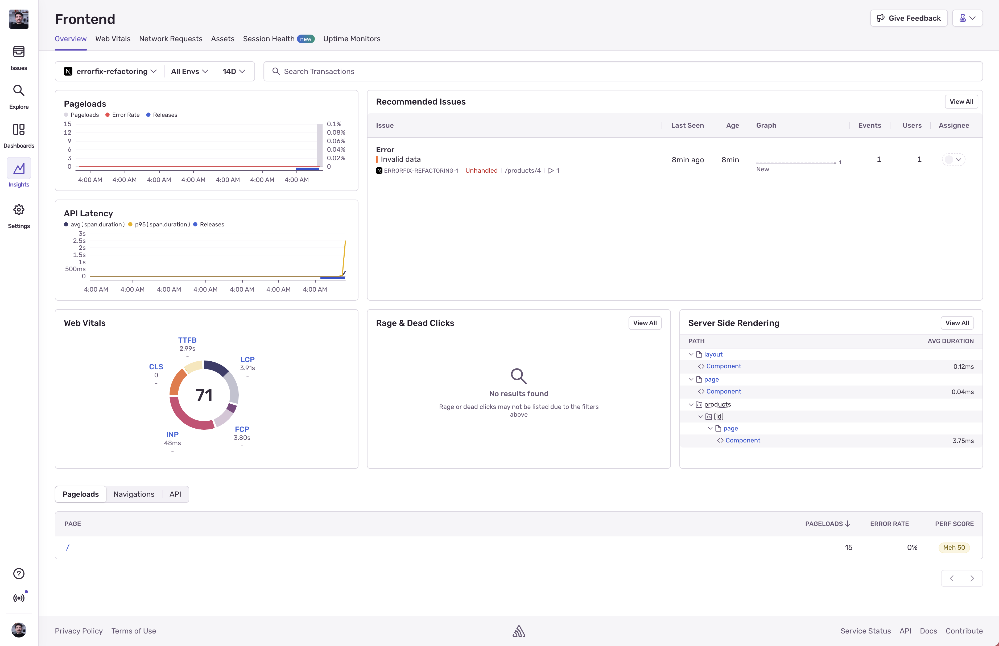

So we've got Sentry installed now; great. Let&apos;s get to exploring what&apos;s going on with project.

## Houston, We Have Several Problems

Picture this: You visit ErrorFix&apos;s marketplace, eager to pick up some sweet swag, and you&apos;re waiting… and waiting… and waiting. Infact, lets not picture it - lets actually see it!

To get started, run the following command to start the application:

```bash
npm run dev
```

This will build our applications frontend, spin up the backend, and give us our application running at http://localhost:8000.

Open it up and lets kick the tires!

## Sentry's Next.js Framework View

Did you know Sentry built a framework view for Next.js? If you head into Insights, select your project, and you&apos;ll see it! This view is great for giving you a view into errors and performance that matches up with what you would expect from Next.js.



This framework view gives you performance insights into:

- Pageloads
- Current Issues
- API Latency
- Web Vitals
- Rage & Dead Clicks
- SSR Performance
- Per page pageload, navigation, and API performance & error rate

We&apos;ll be using this view to help us identify where the performance is going down.

Enough talking about it; lets get to fixing some issues.
