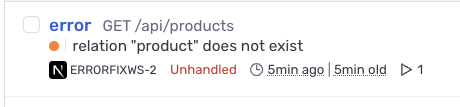
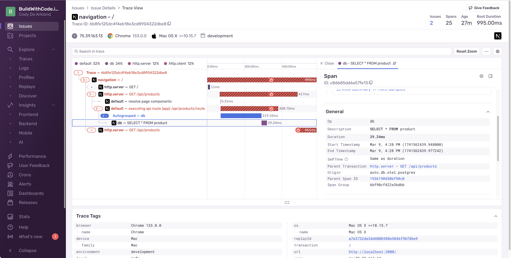
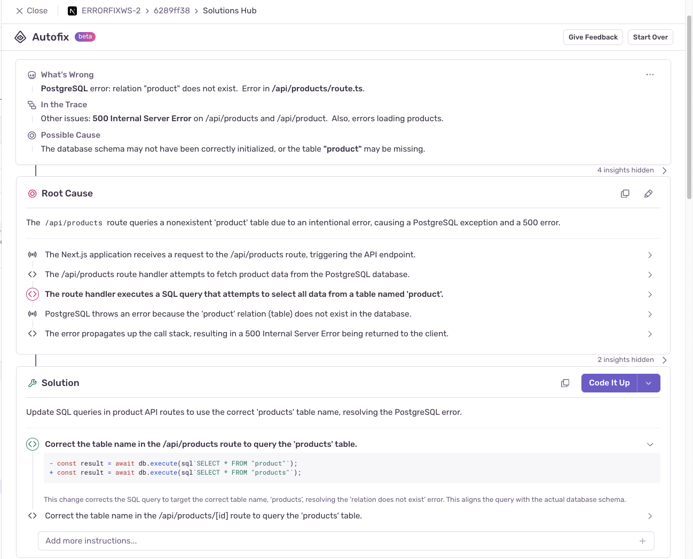
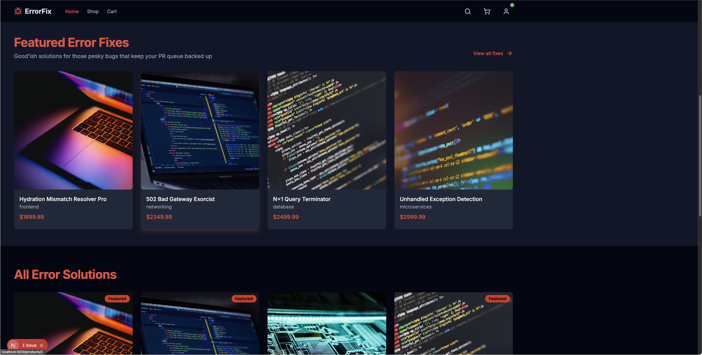

import { Steps } from '@astrojs/starlight/components';

Let's start by exploring the error in our Products API. Open the Sentry issue for this one and explore the details. 


Within this issue, you'll be able to see: 

* Details on the error
* A stack trace for the code
* Important debugging context information like browser, user, and environment details
* Replays (when available)
* Traces and Span's related to your issue
* And root cause and resolution information from Sentry's AI product Seer (Autofix)

We can use this information to help fix the issue. Let's open `/api/products/route.ts`. We're goign to upate our try/catch with the new `Sentry.captureException(error)` method, 

<Steps>
  1. **Update the import statement**

     ```javascript
     // this is line 4
     import * as Sentry from '@sentry/nextjs';
     ```

  2. **Update the catch block in your code**

     ```javascript
     } catch (error) {
         console.error('Error in products API route:', error);

         // SENTRY-THIS: Cathing your exceptions!
         Sentry.captureException(error);

         return NextResponse.json(
     ```
</Steps>

Now, we'll get high detail error captures when this route fails, that we can use to debug our application issue.

## Resolving Issue 1 - Problems in the Products API

Sentry issues are collectons of errors and events that have come into the platform. Let's jump into one related to our frontend. 



* Details on the error message that was thrown - `relation "product" does not exist`
* This is happening on a GET call, in the /api/products route
* Seer (AutoFix) is telling us that the "product" relation doesn't exist; which is a database error. We could use Seer to go and determine what's wrong and fix the issue; but then our bosses won't appreciate how hard this is. Lets keep exploring
* We can see a replay shows exactly how the error happens from the uesr's point of view; with related breadcrumbs
* We can see a our traces and spans that show the failing communication in the api route

If we dive into our the span within our trace, we can see its been automatically instrumented to understand a database query was taking place.



**This is why you should use the Drizzle native query builder**, and not just YOLO raw SQL. Oh Well... Technical debt is a future you problem. 

When we look at Autofix, we can see it's suggesting a fix for the issue. 



<Steps>
  1. **Locate the issue in the API route**
     
     Find the problematic query in `/api/products/route.ts`:

     ```javascript
     const result = await db.all(sql`SELECT * FROM "product"`);
     ```

  2. **Update the query with the correct table name**

     ```javascript
     const result = await db.all(sql`SELECT * FROM "products"`);
     ```

  3. **Save your file and reload your browser**
     
     Products should now be displayed correctly.
</Steps>

 

But, when when we click into these, we get a loading error. Pherhaps all is not well in our store afterall...