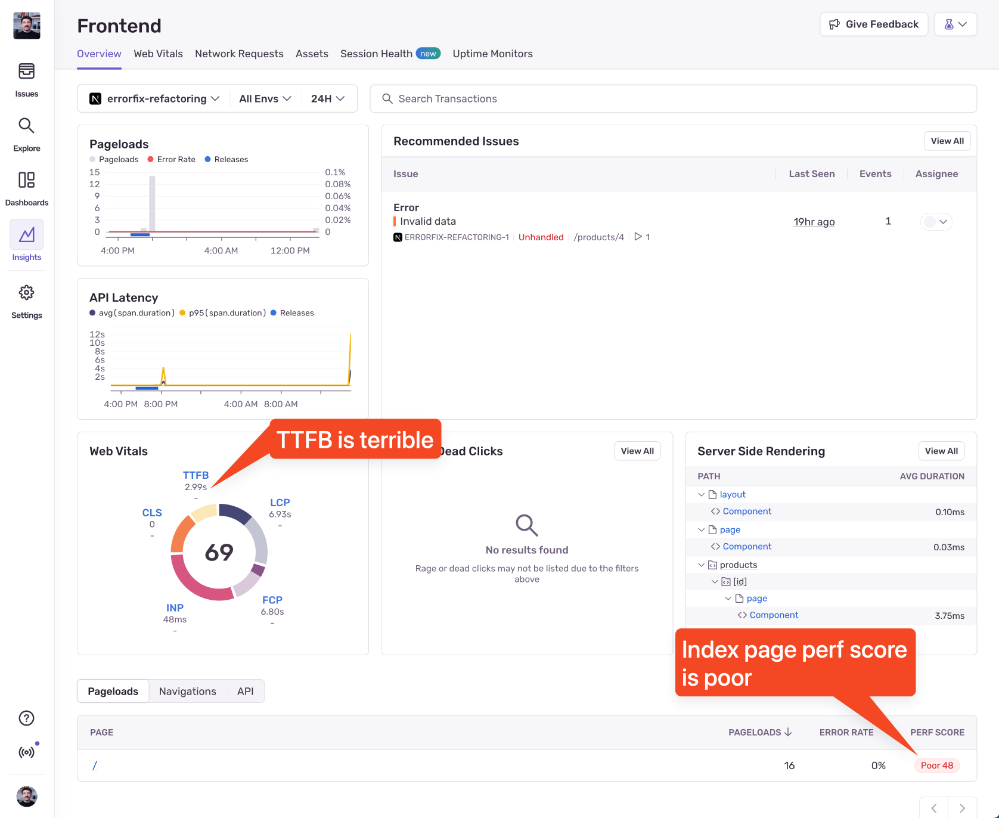
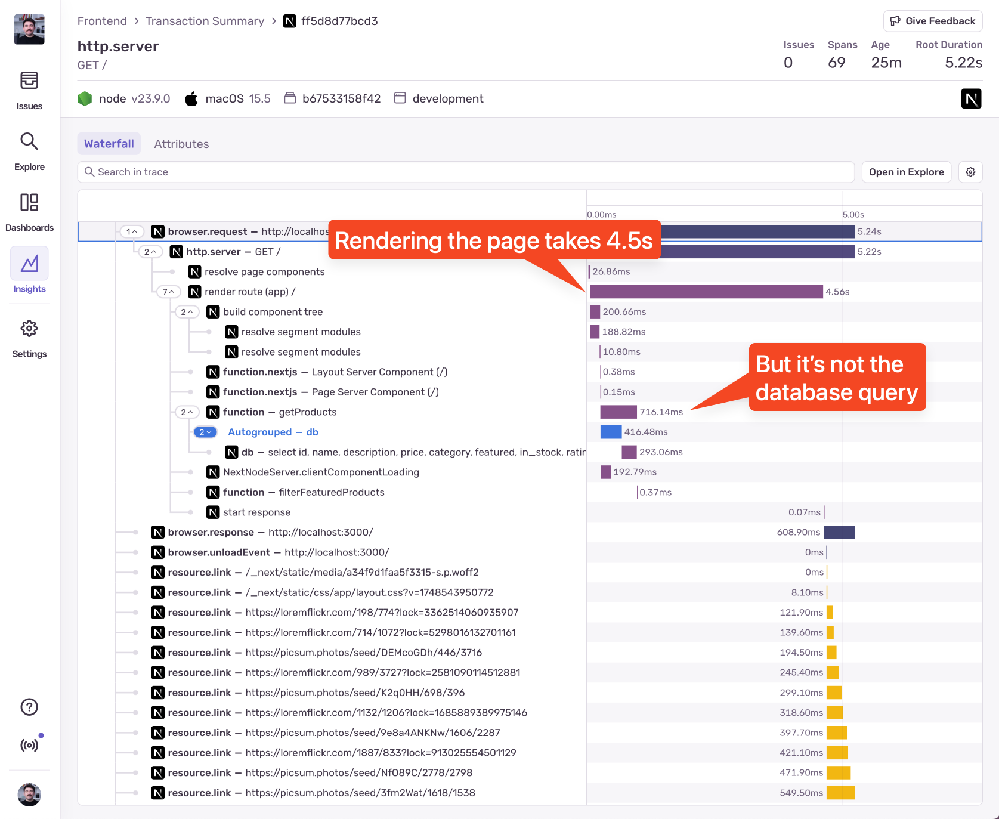
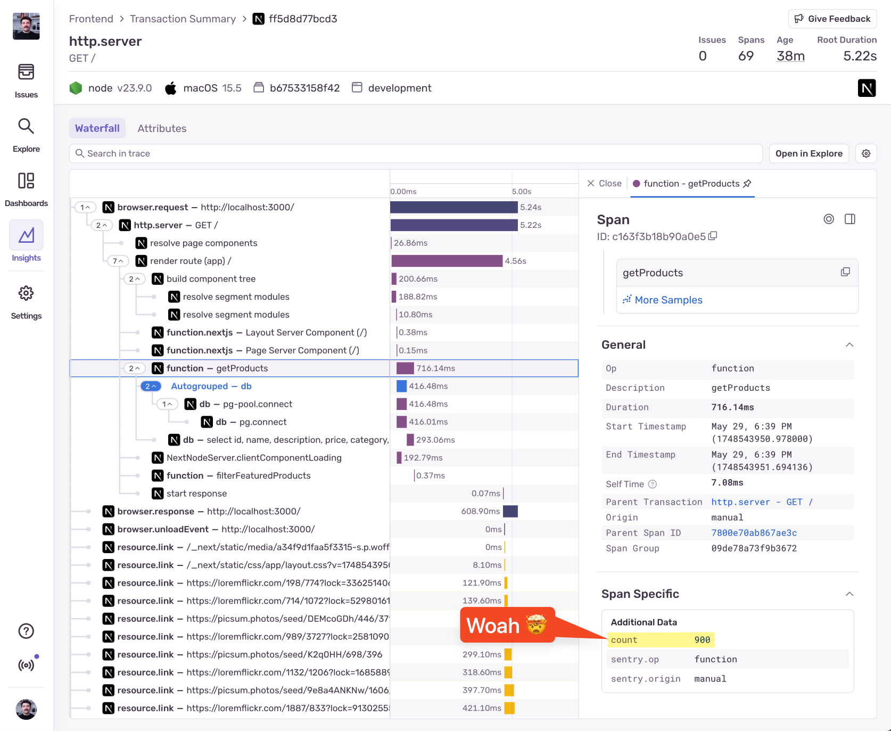

We can easily see that our homepage is running slow. It takes a long time to load, and clicking on the “Browse Featured Products” takes an awkward amount of time. Let&apos;s open the Frontend Insights page in Sentry to see if we can find out what&apos;s going on.



## Investigating the issue

We can see that our homepage is running slow, and Sentry confirms it. Let&apos; click into it, go to the "Sampled Events" tab, and select an event from the list.



Okay so we can see that the page rendering is slow, but it&apos;s not necessarily due to a slow database query. The `getProducts` query is just 716ms. Between data fetching and responding to the browser, Next.js is rendering the page, so that&apos;s where the majority of the time is being spent. Looking at the yellow `resource` spans below, we can suspect that we are trying to render way too many products on the page without implementing pagination or lazy loading.

Let&apos;s confirm that we are indeed rendering way too many products on the page. We&apos;re going to add a custom span in the `ClientProducts.tsx` file in the `getProducts` function:

```ts
async function getProducts() {
  // Start a custom span
  return Sentry.startSpan({
    name: 'getProducts',
    op: 'function',
  }, async (span) => {
    const result = await db.select().from(products);

    // Set the number of products as an attribute on the span
    span.setAttributes({
      count: result.length,
    });

    return result;
  });
}
```



Aah there it is. We are returning 900 products from the database. Next.js is trying to render all of them, and that&apos;s why the page is so slow. How are we obtaining the products?

```ts
const result = await db.select().from(products);
```

Yep. There&apos;s no filtering or limit to the query. We are returning all products from the database, which happen to be 900.

The way we can fix this is by implementing pagination. To keep it simple, we&apos;ll just limit the number of products returned to someething reasonable, but in real life we would implement a proper pagination system.

One issue down, moving to the next one!