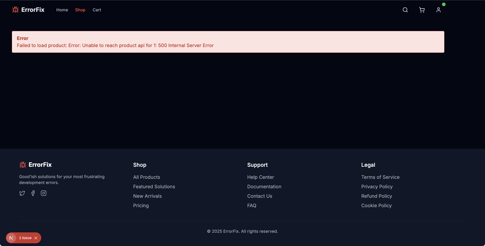
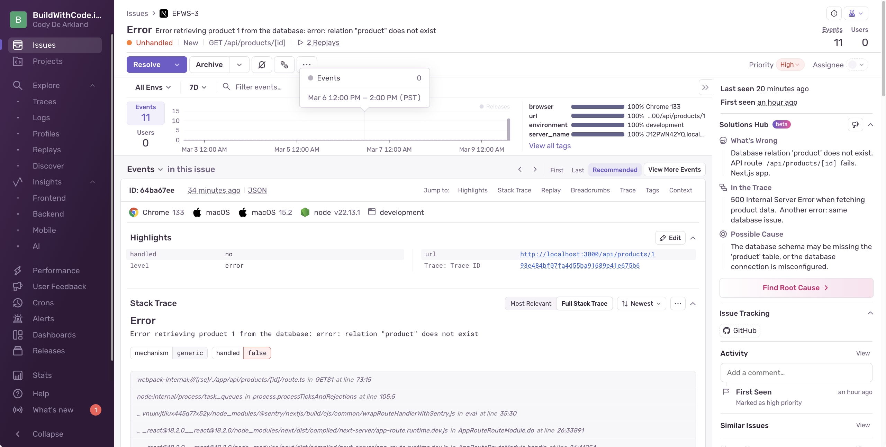
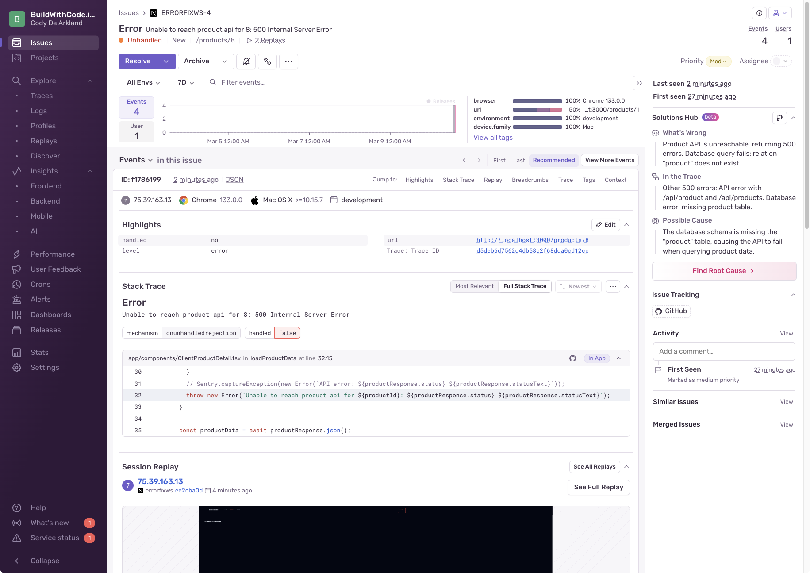
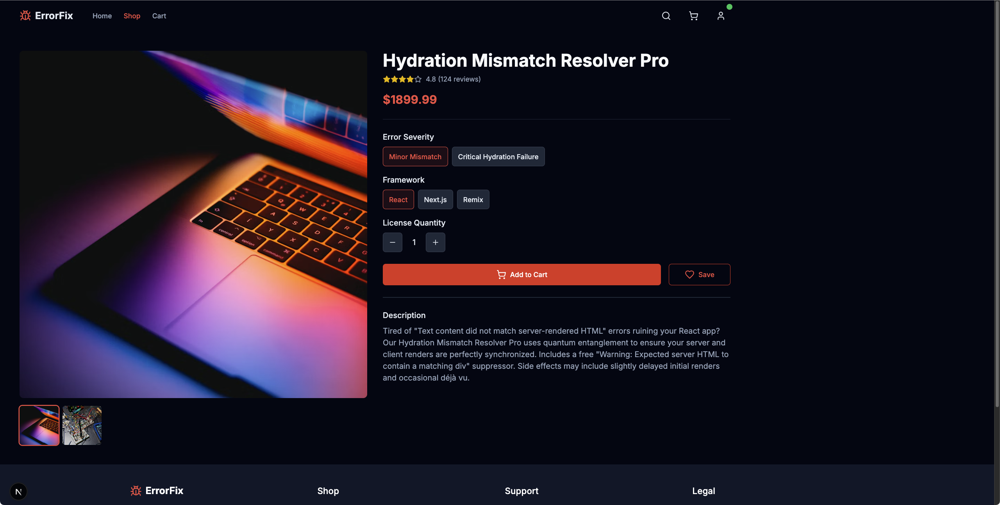

import { Steps } from '@astrojs/starlight/components';

All of our single product views are currently broken. We can see the overall collection of products in our marketplace, but when we click into any of them, we get a sad state of the world. 



Let's jump into one of the issues in Sentry and see what we can learn.



We can explore the Sentry Issue to get details on the error and context around how to solve it. We're seeing similar suggestions to the previous API issue from Autofix on the root cause.




## Resolving Issue 2 - "Fix Me" Getting Fixed Up

What are the odds that the same syntax issue happened in another route? Pretty high we'd bet. 

In code, navigate to the `/app/api/products/[id]/route.ts` file. To help safeguard us from problems in the future, let's add some error tracking.

This is the route that's supposed to handle individual product details but is currently handling... well, disappointment. 

<Steps>
  1. **Add error tracking with Sentry**

     ```javascript
     import { initDb } from '@/lib/db/db-server';
     // this is line 4
     import * as Sentry from '@sentry/nextjs';
     import { products } from '@/lib/data';
     ```

  2. **Implement error capturing in the catch block**

     ```javascript
     } catch (error) {
         console.error(`API error for product ${id}:`, error);
         
         // SENTRY-THIS: Cathing your exceptions!
         Sentry.captureException(error);

         // Return standardized error response with more details
         return NextResponse.json(
     ```
</Steps>

When code breaks in the future, we'll be thanking our past selves for setting this up in a way that gets us more context around fixing the issue. 

Since Autofix already suggested a fix for the API issue, let's apply it to this route as well.

<Steps>
  1. **Locate the issue in the API route**
     
     Find the problematic query in the product detail route:

     ```javascript
     const result = await db.all(sql`SELECT * FROM "product" WHERE id = ${numId}`);
     ```

  2. **Update the query with the correct table name**

     ```javascript
     const result = await db.all(sql`SELECT * FROM "products" WHERE id = ${numId}`);
     ```

  3. **Save your file and test the functionality**
     
     Reload the browser and click on any of the products OR the "Fix Me" hero button.
</Steps>



Looks like our store's product lists are back in business! Let's add it to the cart, and test our check out flow. 

Unforutnately, when we try to check out, we're greeted with a login screen that is unwilling to let us pass

Who doens't like giving into a hand-rolled authentication product?