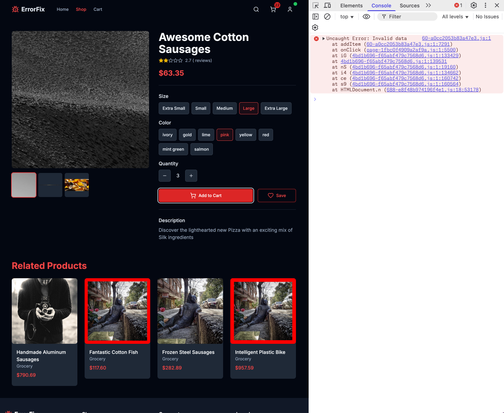
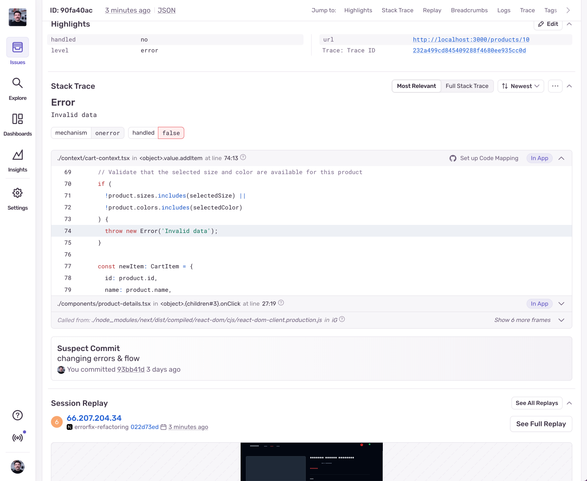
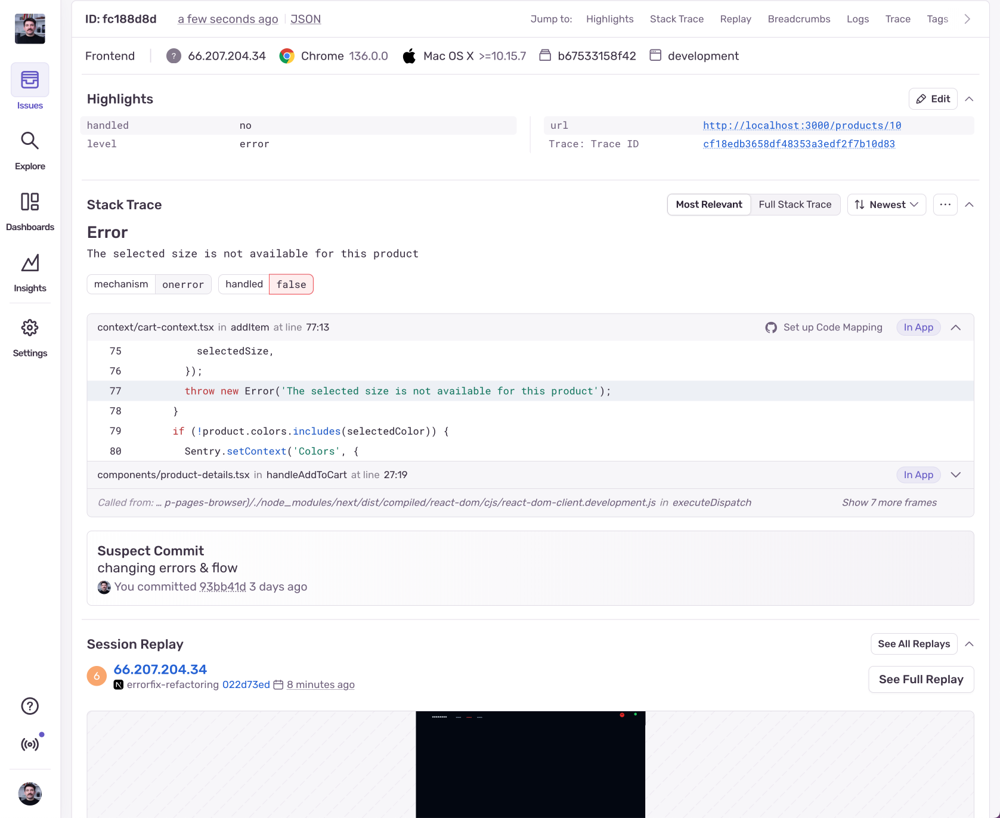
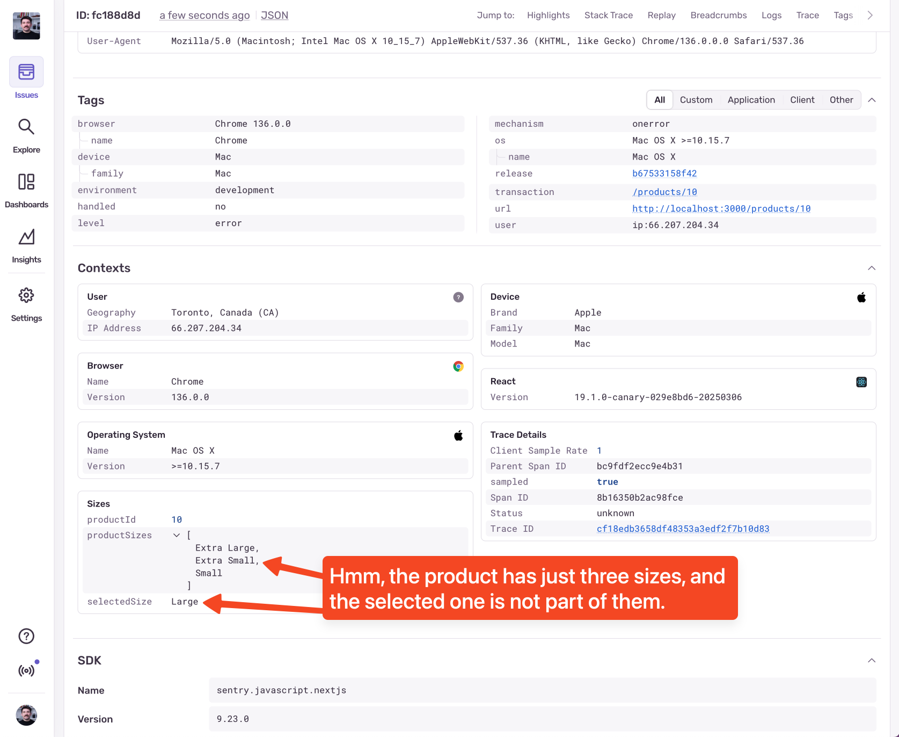

import { Steps } from '@astrojs/starlight/components';

The "Add to Cart" button is acting weird. Sometimes it works and displays a success message, but other times it doesn't do anything. If we look at the console we'll see that it's throwing errors, but the errors are minified and obfuscated in Production, so we can't figure out what's going on. We have a vague error message saying "Invalid data", and the stack trace is anything but helpful.



Since we've already set up Sentry's SDK, there's an error waiting for us in the dashboard.



Immediately we can see that Sentry has unminified and un-obfuscated the stack trace for us, so we can see the exact line of code that's causing the issue. Looking at the stack trace, we can see that the error is thrown only if the selected size is not included in the product's `sizes` array, or the selected color is not included in the product's `colors` array. We can also see in the "Highlights" section above that the error is not handled. It's thrown, but not caught so it bubbled up all the way to the top.

This is a common example of how errors are being handled. The "proper" way to handle errors is to:
1. Be descriptive with the error message and include the context of the error;
2. Catch the error so it doesn't bubble up to the top;
3. Provide a UI feedback to the user so they know something went wrong.

## Improving the error context

To debug this error we need a lot more context. We need to know which size and/or color the user selected, which product the user tried to add to the cart, and which sizes and/or colors are available for that product.


<Steps>
  1. **Import Sentry's SDK**

     ```javascript
     import * as Sentry from '@sentry/nextjs';
     ```

  2. **Add the additional context to Sentry before throwing the error**

     ```javascript
     if (!product.sizes.includes(selectedSize)) {
         Sentry.setContext('Sizes', {
             productId: product.id,
             productSizes: product.sizes,
             selectedSize,
         });
         throw new Error('The selected size is not available for this product');
     }
     if (!product.colors.includes(selectedColor)) {
         Sentry.setContext('Colors', {
             productId: product.id,
             productColors: product.colors,
             selectedColor,
         });
         throw new Error('The selected color is not available for this product');
      }
     ```

</Steps>

Now we're going to get a much more descriptive error message in Sentry, and we'll also be able to see the extra context in the "Contexts" section below.




This tells us that a user has requested the "Large" size of the product with ID `10`, but the product does not have that size in its `sizes` array. If the product does not have that size, we should not let the user select it, but looking at how we render the sizes, we are:
```typescript
// product-details.tsx, line 105
{['Extra Small', 'Small', 'Medium', 'Large', 'Extra Large'].map((size) => (
  <div key={size} className="flex items-center">
    ...
  </div>
))}
```

## Resolving Issue 2 - Fixing the size options rendering

This is a straightforward fix, but we weren't able to realize it with just the `Invalid data` error message. Now since we know that the issue is in us letting the users select sizes that are probably not available, we can fix it by looping through the product's `sizes` instead:
```typescript
{product.sizes.map((size) => (
  <div key={size} className="flex items-center">
    ...
  </div>
))}
```

This will not render any sizes that are not available for the product, which will prevent the user from selecting them. We also need to handle the thrown error and show a toast telling the user what went wrong, but I'll leave that to you.

The most important thing is now we know how we can enrich all of our application's errors with additional context that will help us debug them faster. Suddenly, the errors don't seem so scary anymore.