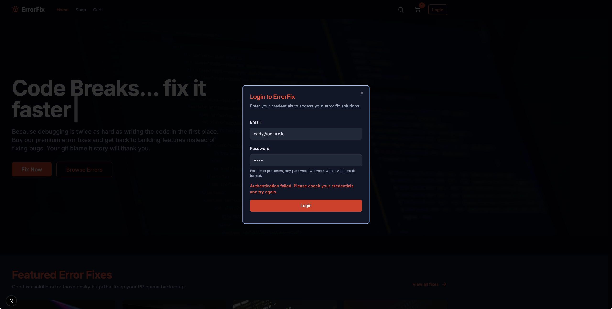
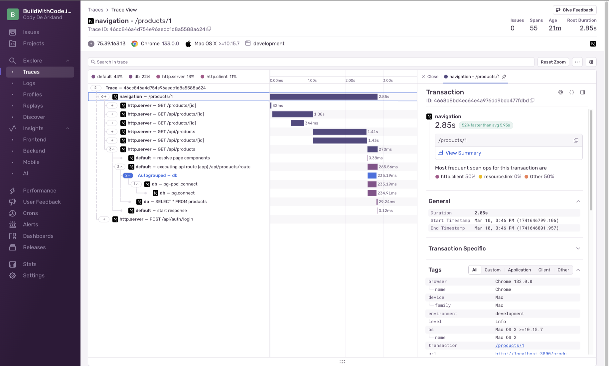
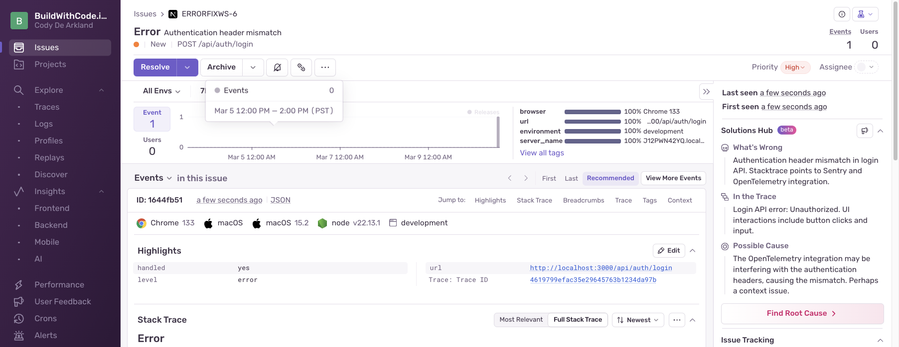
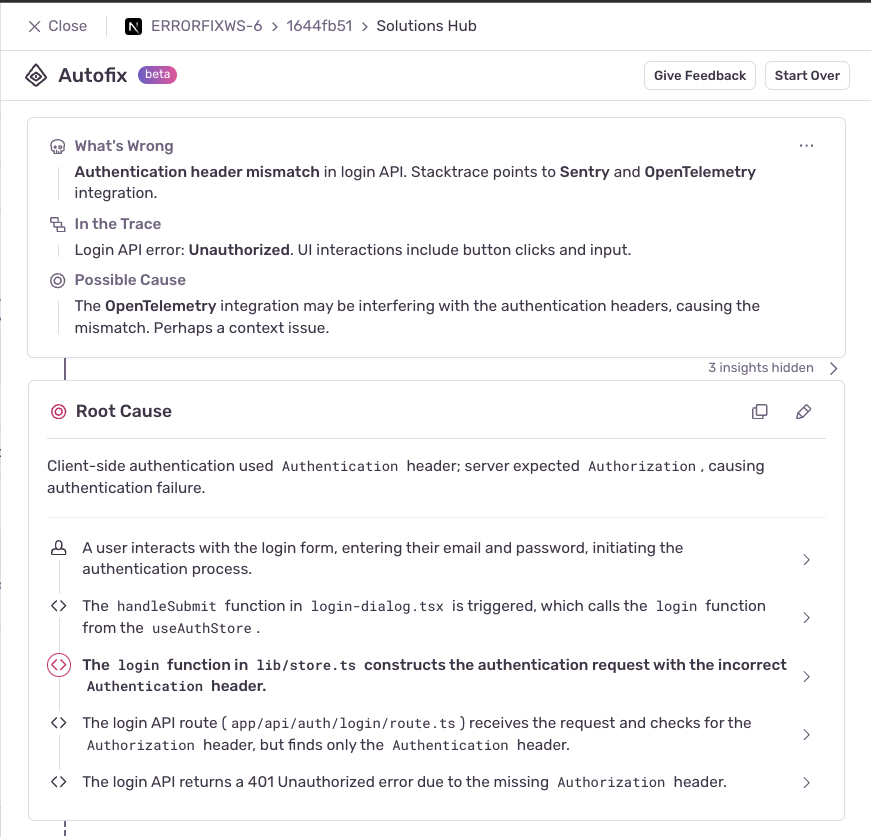
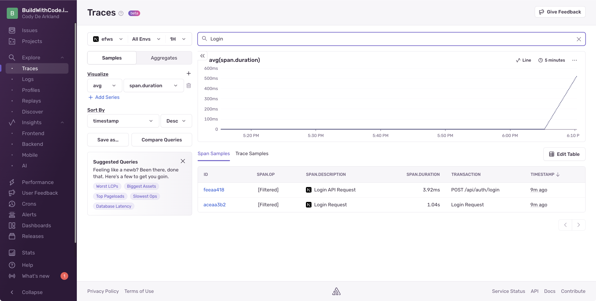
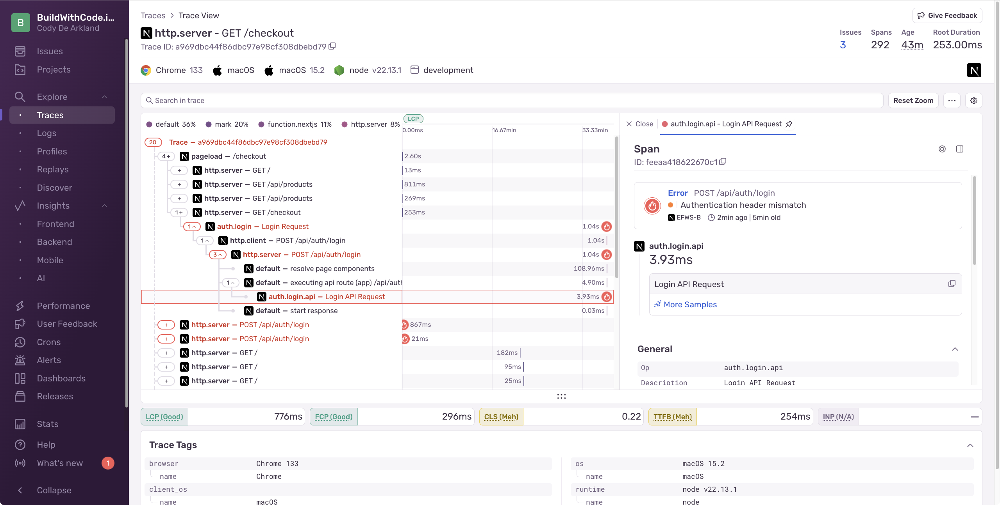
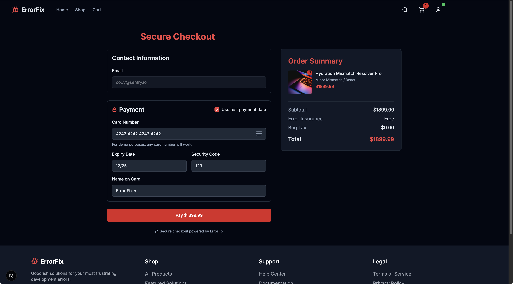
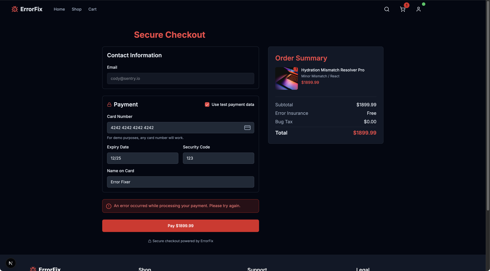

import { Steps } from '@astrojs/starlight/components';

 

Auth is always fun to try debugging. In this case, we'll use Sentry's Tracing and Span's to help us understand what's breaking down in the communication flow. 

By default, Sentry instruments A LOT of spans, but when you want custom values and easier searchability - Custom Spans are a great option.



By instrumenting spans, we can monitor the performance and communication between frontend and backend systems, and understand where problems are happening in the 
application. 

<Steps>
  1. **Update the Frontend Code**

     Open up `/app/lib/store.ts` and replace the entire login call with the below code:

     ```javascript
     // top of the file 
     import * as Sentry from '@sentry/nextjs';


     // replace login section with this
     login: async (email: string, password: string) => {
       try {
         return await Sentry.startSpan(
           {
             name: "Login Request",
             op: "auth.login",
             attributes: {
               "authHeader.property": AUTH_CONFIG.authHeaderName,
               "auth.method": "password",
               "email.domain": email.split('@')[1] || 'unknown'
             }
           },
           async (span) => {
             // First validate the email format
             const emailRegex = /^[^\s@]+@[^\s@]+\.[^\s@]+$/;
             if (!emailRegex.test(email)) {
               span.setAttributes({
                 "validation.error": "invalid_email_format",
                 "request.success": false
               });
               
               return { 
                 success: false, 
                 error: 'Invalid email format. Please try again.' 
               };
             }
             
             const response = await fetch('/api/auth/login', {
               method: 'POST',
               headers: {
                 'Content-Type': 'application/json',
                 [AUTH_CONFIG.authHeaderName]: 'Bearer ' + btoa(`${email}:${password}`)
               },
               body: JSON.stringify({ email, password }),
             });
             
             // Set span attributes with response info
             span.setAttributes({
               "http.status_code": response.status,
               "request.success": response.ok
             });
             
             if (!response.ok) {
               // Capture the API error with Sentry
               Sentry.captureMessage(`Login API error: ${response.statusText}`, {
                 level: "error",
                 tags: {
                   errorType: "login_error",
                   errorCode: response.status.toString(),
                   httpStatus: response.status,
                   authHeaderUsed: AUTH_CONFIG.authHeaderName
                 }
               });
               
               // Generic error message that doesn't reveal the actual issue
               return { 
                 success: false, 
                 error: 'Authentication failed. Please check your credentials and try again.' 
               };
             }
             
             const data = await response.json();
             
             if (data.user) {
               span.setAttributes({
                 "auth.success": true,
                 "user.id": data.user.id
               });
               
               set({ user: data.user, isAuthenticated: true });
               return { success: true };
             } else {
               span.setAttributes({
                 "auth.success": false,
                 "error.reason": "invalid_credentials"
               });
               
               return { 
                 success: false, 
                 error: 'Invalid credentials. Please try again.' 
               };
             }
           }
         );
       } catch (error) {
         console.error('Login error:', error);
         
         // Capture the exception with Sentry
         Sentry.captureException(error, {
           tags: {
             errorType: "login_error",
             errorSubtype: "client_exception"
           },
           extra: {
             authConfig: AUTH_CONFIG
           }
         });
         
         // Generic error message that doesn't reveal the actual issue
         return { 
           success: false, 
           error: 'An error occurred during login. Please try again later.' 
         };
       }
     },
     ```

  2. **Update the Server-Side Code**

     Next, update the server-side code in `/app/api/auth/login/route.ts`:

     ```javascript
     // top of the file 
     import * as Sentry from '@sentry/nextjs';

     // replace the POST section with this
     export async function POST(request: Request) {
       try {
         return await Sentry.startSpan(
           {
             name: "Login API Request",
             op: "errorfix.login.api",
             attributes: {
               "authHeaderExpected.property": SERVER_AUTH_CONFIG.expectedAuthHeaderName,
               "http.method": "POST",
               "http.route": "/api/auth/login"
             }
           },
           async (span) => {
             const allHeaders = Object.fromEntries(request.headers.entries());
             const authHeader = request.headers.get(SERVER_AUTH_CONFIG.expectedAuthHeaderName);
             
             const wrongAuthHeader = request.headers.get('Authentication');
             
             span.setAttributes({
               "auth.header.present": !!authHeader,
               "auth.wrong_header.present": !!wrongAuthHeader,
               "auth.all_headers": JSON.stringify(allHeaders)
             });
             
             if (!authHeader && wrongAuthHeader) {

               Sentry.captureException(new Error("Authentication header mismatch"), {
                 tags: {
                   errorType: "auth_error",
                   errorSubtype: "header_name_mismatch",
                   expectedHeader: SERVER_AUTH_CONFIG.expectedAuthHeaderName,
                   receivedHeader: "Authentication"
                 },
                 extra: {
                   headers: allHeaders,
                   endpoint: "/api/auth/login"
                 }
               });
               
               return NextResponse.json(
                 { 
                   error: 'Authentication failed',
                   message: 'Invalid authentication credentials',
                   code: 'AUTH_FAILED'
                 },
                 { status: 401 }
               );
             }
             
             const body = await request.json();
             const { email, password } = body;
             
             const emailRegex = /^[^\s@]+@[^\s@]+\.[^\s@]+$/;
             if (!emailRegex.test(email)) {
               return NextResponse.json(
                 { 
                   error: 'Invalid email format',
                   message: 'Please provide a valid email address',
                   code: 'INVALID_EMAIL'
                 },
                 { status: 400 }
               );
             }

             let userId;
             
             switch (SERVER_AUTH_CONFIG.idGenerationMethod) {
               case 'standard':
                 userId = Math.random().toString(36).substring(2, 15);
                 break;
               case 'legacy':
                 userId = `legacy-${Math.random().toString(36).substring(2, 5)}`;
                 break;
               case 'uuid':
                 userId = `${Date.now()}-${Math.random().toString(36).substring(2, 7)}`;
                 break;
               default:
                 userId = `user-${Math.random().toString(36).substring(2, 10)}`;
             }
             
             span.setAttributes({
               "auth.success": true,
               "user.id": userId
             });
             
             const user = {
               id: userId,
               email,
               name: email.split('@')[0],
             };
             
             return NextResponse.json({ user });
           }
         );
       } catch (error) {
         console.error('Login API error:', error);
         
         Sentry.captureException(error, {
           tags: {
             errorType: "auth_error",
             errorSubtype: "login_exception"
           },
           extra: {
             endpoint: "/api/auth/login",
             requestTime: new Date().toISOString()
           }
         });
         
         return NextResponse.json(
           { 
             error: 'Authentication failed',
             message: 'An error occurred during the authentication process',
             code: 'AUTH_ERROR'
           },
           { status: 500 }
         );
       }
     }
     ```

  3. **Test the Login Flow**

     Reload your application and try the login flow again. You'll still receive the login error as expected, but now with Sentry instrumentation providing error tracking, tracing, and spans.
</Steps>

 

We're even getting another nudge from Autofix helping guide us to the root cause. 




## Enter Trace Explorer

Not, Autofix already spoiled part of this for us, those crafty robots - but lets continue anyways.

<Steps>
  1. **Navigate to Trace Explorer**
     
     Select the "Traces" tab on the left to run queries against traces and spans, and get more information on performance issues or what's actually breaking.

  2. **Search for Login Traces**
     
     On the search bar, type in "Login" and hit enter. You may need to ensure your filters are set correctly.

     

  3. **Analyze the Span Details**
     
     We'll see our Spans in the results for the login operations. Dive into the `Login API Request` span, and expand the problem sections to see more details on what's going on.

     

     In the span attribute properties on the right, we can see we're receiving an "Authentication header Mismatch" error.
</Steps>

## Resolving Issue 3 - Authentication Header Mismatch

Debugging the authentication header mismatch is much easier using the combination of Sentry error monitoring and tracing. With issues we get details on the error and context around the user interaction, and tracing lets us see the request flow and capture the peoperties being passed between both. 

Our debuging shows us that in the `/app/api/auth/login/route.ts`, we expects an `Authorization` header, however when we look at `/app/lib/store.ts` we see it's using `Authentication` instead. 

<Steps>
  1. **Locate the Problem in the AUTH_CONFIG Object**
     
     There's an `AUTH_CONFIG` object that contains the header name in the `store.ts` file that needs to be updated.

  2. **Update the Header Name**
     
     Change this section:

     ```javascript
     const AUTH_CONFIG = {
       authHeaderName: 'Authentication', 
       tokenPrefix: 'Bearer'
     };
     ```

     To this:

     ```javascript
     const AUTH_CONFIG = {
       authHeaderName: 'Authorization', 
       tokenPrefix: 'Bearer'
     };
     ```

  3. **Save and Test**
     
     Save and update the file, reload the page, and try the login again. You should see a successful login and the checkout form!
</Steps>



Now, finally, everything has to be fixed. Let's click `Use test payment data`, complete our pay... well.. turns out that's broken too. 

Whoever built this application needs to step away from the keyboard. 

