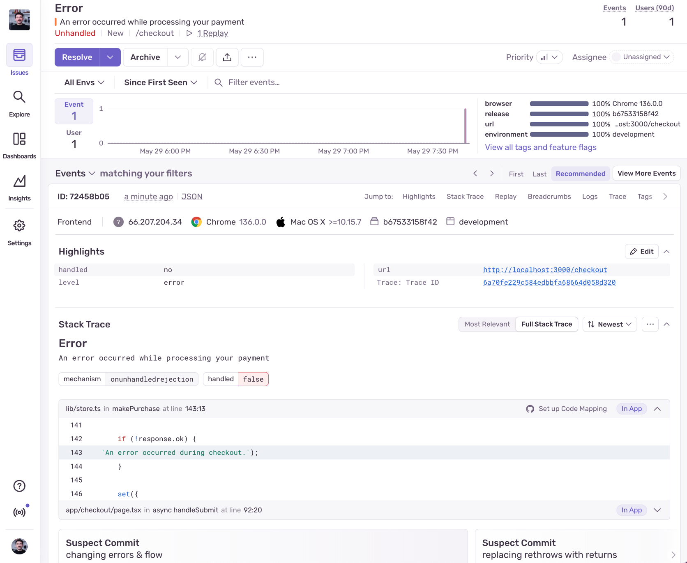
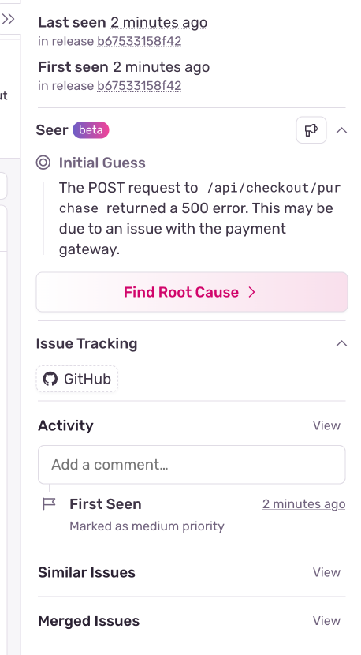
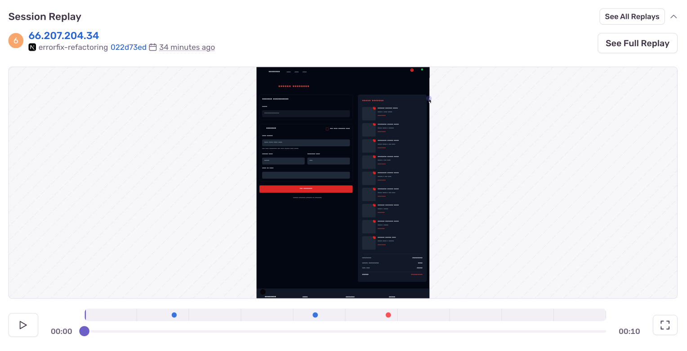
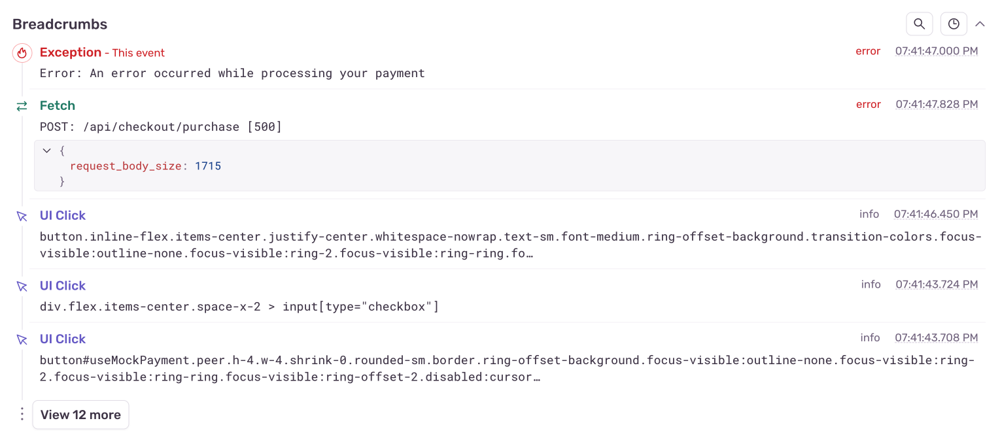
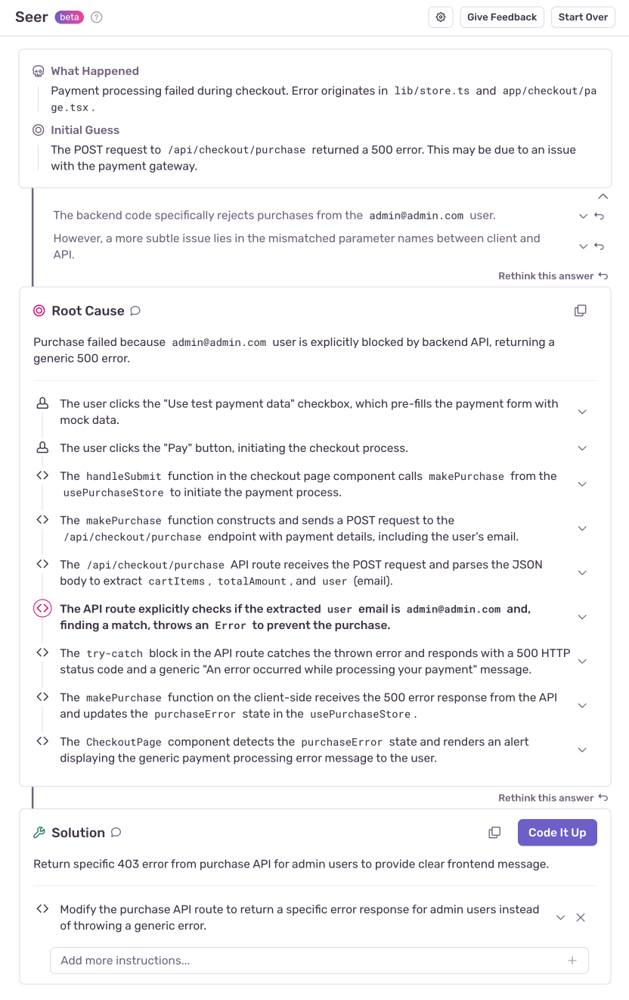
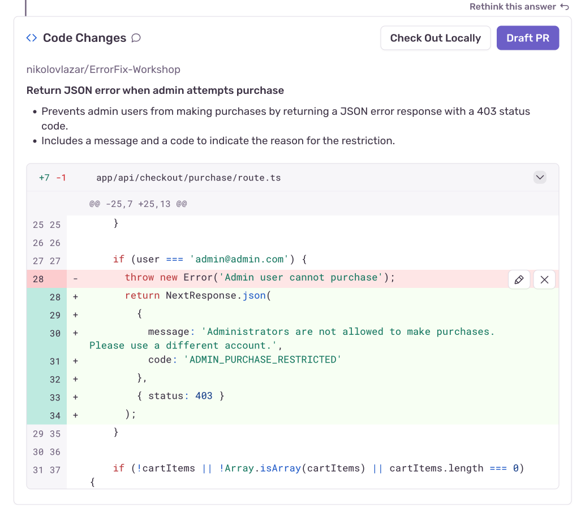
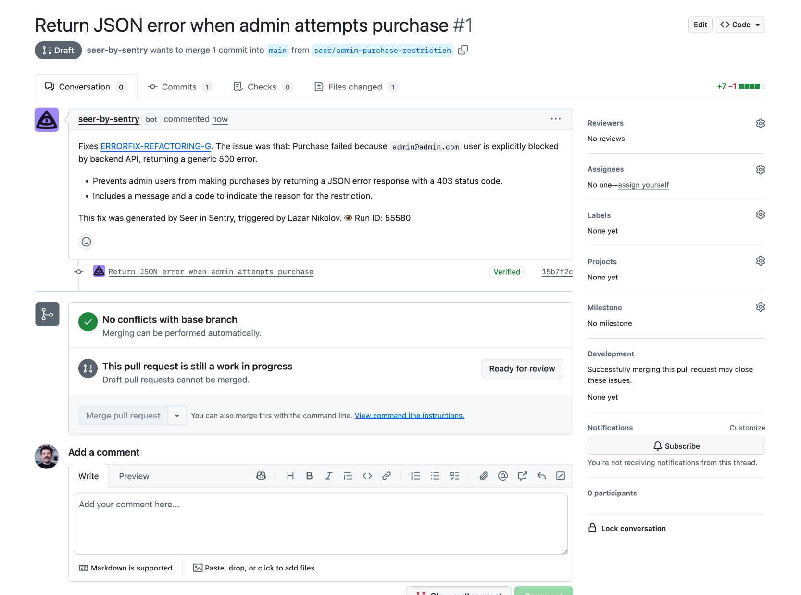

import { Steps } from '@astrojs/starlight/components';

We saved the most challenging issue for last. We keep getting the following error in Sentry:

This is also a very common situation lots of Sentry users face. They get an error in Sentry that doesn't immediately give them the information they need to fix the issue. We need to dig deeper.

## Investigating the issue

Since stack traces don't give us much information, we're going to use a combination of Breadcrumbs, Session Replay, and Seer to investigate the issue. Let's start with Seer.

### Seer

Seer is a feature in Sentry that uses AI to help you figure out what went wrong, even in situations where the error message or stack trace doesn't give you enough information. If we look at the right sidebar, we'll see Seer.

Seer is able to give us an overview of the issue:
* It's a 500 error on the `/api/checkout/purchase` endpoint
* It may be due to an issue with the payment gateway

The best thing about Seer is that we can ask it to dig much deeper and find the root cause, and even open a PR with the fix once it figures it out. Let's click the "Find Root Cause" button and start the autofix process. We'll come back to it later.

### Session Replay

The next thing we should check out is Session Replay. Session Replay is a visual representation of the user's session at the moment when the error occurred. If we scroll down below the "Stack Trace" section, we'll see the Session Replay.

If we hit play, we'll see how the user fills in the form and clicks submit. We can see that the user is able to fill in the form and click submit without any issues, but then nothing happens. No error message, no success message, nothing. So, Seer was right. It's a problem with the actual checkout process, which we trigger by sending a `POST` to `/api/checkout/purchase` along wit the form data.

### Breadcrumbs

But what if we didn't have a replay? In that case, we can turn to the Breadcrumbs. The Breadcrumbs feature allows us to see all the events that happened leading up to the error, like where the user clicked, where the user navigated, or what networking events happened. If we look below the Session Replay section, we'll see the Breadcrumbs:

And looking at them, they confirm exactly what Seer said, and Session Replay showed us - the browser sent a `POST` request to `/api/checkout/purchase` that resulted in a 500.

You've probably realized by now that there are multiple ways to investigate an issue in Sentry. But let's check up on Seer and see if it has an answer for us.

### Back to Seer

Seer takes into account all of the information and data it has on the project, like the stack trace, error message, breadcrumbs, tags, trace, even session replay. And it's not limited to just Sentry data. It also uses the GitHub Integration to get information about the codebase.

Because of that, Seer was able to jump from our React project to the Laravel project and figure out why the issue was happening.

It figured out that the root cause of the issue was that the purchase was made using the `admin@admin.com` account, which does not have permission to make purchases therefore the backend threw an exception.

It even gave us a suggested fix: _"Return specific 403 error from purchase API for admin users to provide clear frontend message"_. If we're happy with that suggestion, we can click on the "Code It Up" button and Seer will open a PR in our repository with the fix. After some time, Seer will show us the changes it would do to the codebase, and the option to create a Draft PR.

Let's go ahead and create a Draft PR.

And it sure did! It even wrote a great description that explains what the PR does, and links to the issue in Sentry that it's fixing. At this point we can try it out locally, modify it if needed, and merge it once we're happy with it.

We just had a robot fix a bug for us.

🤯