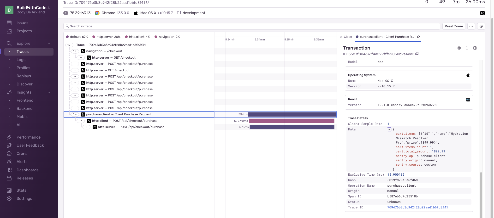
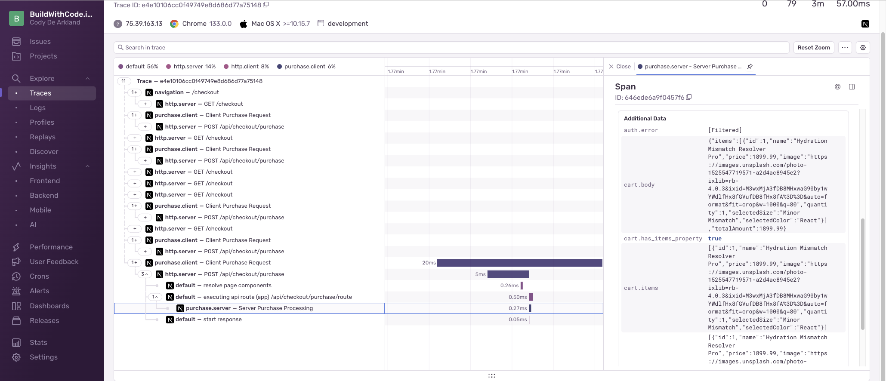
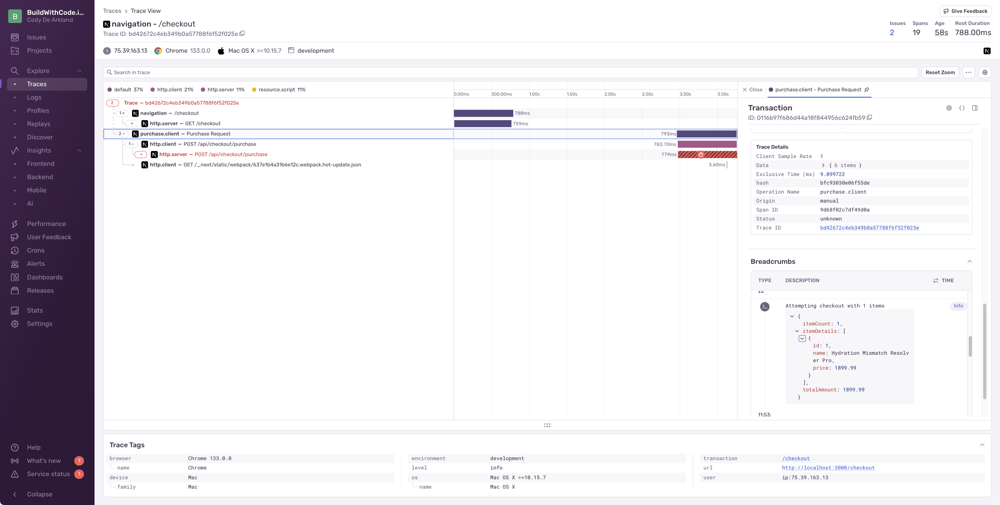
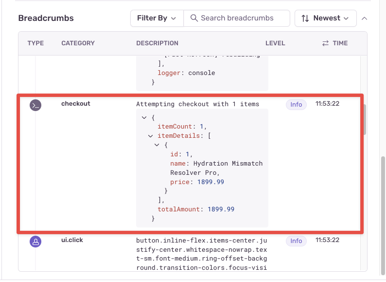
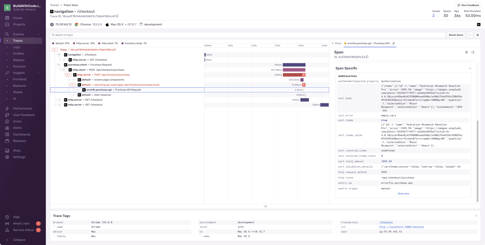
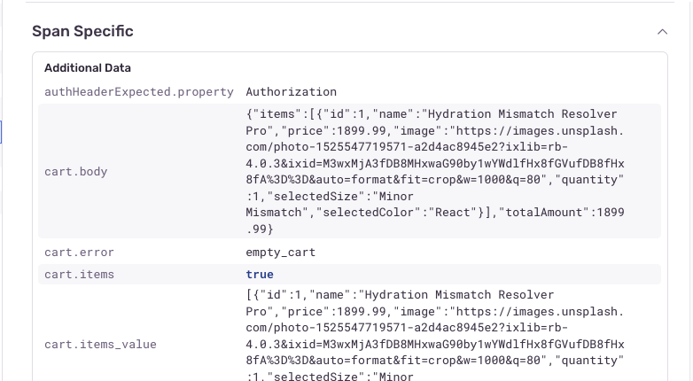
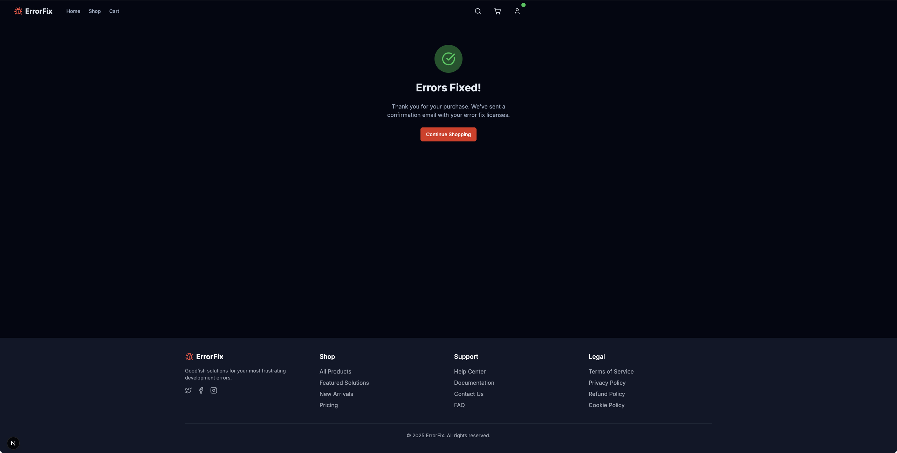

import { Steps } from '@astrojs/starlight/components';

## The Final Chapter - Fixing the "Gimme Money" button

In our client-side code, we're able to successfully add items to the cart. We're able to login successfully, and begin the check out process - it fails after that.

We could add a ton of `console.log()` statements to try and figure out how data is moving across, but we've picked up some new tricks on our journey that are a lot more interesting. 

On the Client side, we'll instrument breadcrumbs from Sentry to help us track the interactions within our page. We'll also instrument a Custom Span like we did in the previous lesson to track what properties are being sent. 

Server side, we'll create a span that will track the incoming data, and we can use these to compare the values.

## Client-Side Setup 

<Steps>
  1. **Add Sentry Breadcrumbs**

     We'll start with our Breadcrumbs. Open up `/app/checkout/page.tsx` file, and bring in the Sentry configuration for the custom breadcumb.

     Find the `handleSubmit` function, and place this breadcrumb before the `makePurchase` call:

     ```javascript
     // top of the file 
     import * as Sentry from '@sentry/nextjs';

     // Inside handleSubmit function, before makePurchase call
     Sentry.addBreadcrumb({
       category: 'checkout',
       message: `Attempting checkout with ${items.length} items`,
       level: 'info',
       data: {
         itemCount: items.length,
         itemDetails: items.map(item => ({ id: item.id, name: item.name, price: item.price })),
         totalAmount: totalPrice
       }
     });
     ```

     This breadcrumb will add additional tracking when the user interacts with the component. It will track the individual items in the cart, the total price, and the number of items.

  2. **Instrument Custom Span for Client-Side**

     Next, head to `/app/lib/store.ts` and find the `makePurchase` call. This is the call that actually sends our interaction to the server.

     Replace the entire `makePurchase` call with this:

     ```javascript
     // top of the file 
     import * as Sentry from '@sentry/nextjs';

     makePurchase: async (paymentDetails: { items: Array<{ id: string; price: number; name: string }>; totalAmount: number }) => {
       set({ processingPurchase: true, purchaseError: null });
       
       return await Sentry.startSpan(
         {
           name: "Client Purchase Request",
           op: "purchase.client",
           attributes: {
             "cart.items.count": paymentDetails.items.length,
             "cart.total_amount": paymentDetails.totalAmount,
             "cart.items": JSON.stringify(paymentDetails.items.map(item => ({ id: item.id, name: item.name, price: item.price })))
           }
         },
         async () => {
           try {
             const authState = useAuthStore.getState();
             
             const response = await fetch('/api/checkout/purchase', {
               method: 'POST',
               headers: {
                 'Content-Type': 'application/json',
                 ...(authState.isAuthenticated && authState.user 
                   ? { [AUTH_CONFIG.authHeaderName]: `${AUTH_CONFIG.tokenPrefix} ${authState.user.id}` } 
                   : {})
               },
               body: JSON.stringify(paymentDetails),
             });
           
             const data = await response.json();
             
             if (!response.ok) {
               throw new Error(data.message || 'An error occurred during checkout.');
             }
             
             set({ 
               processingPurchase: false, 
               purchaseComplete: true 
             });
             
             return { success: true };
           } catch (error: any) {
             console.error('Purchase error:', error);
             set({ 
               processingPurchase: false,
               purchaseError: error.message || 'Payment processing failed'
             });

            Sentry.captureException(error, {
              tags: {
                errorType: "checkout_error",
                errorSubtype: "client_exception"
              },
              extra: {
                cartDetails: paymentDetails
              }
            });
             
             return { 
               success: false, 
               error: error.message || 'Payment processing failed. Please try again.' 
             };
           }
         }
       );
     },
     ```

  3. **Test the Client-Side Implementation**
     
     If we re-run our transaction, and look in traces, after a few moments we will be able to search for our `Client Purchase Request` span.

     

     If we expand that span, we can see the attributes we are passing on to the server side code, and part of solving our final issue.
</Steps>

## Server-Side Setup 

<Steps>
  1. **Instrument Server-Side Span**

     Open up `/app/api/checkout/purchase/route.ts` and add a span to capture the incoming request.

     Replace the contents of the POST call with this:

     ```javascript
     // top of the file 
     import * as Sentry from '@sentry/nextjs';

     // replace the POST section with this
     export async function POST(request: Request) {
       return Sentry.startSpan(
         {
           name: "Server Purchase Processing",
           op: "purchase.server",
         },
         async (span) => {
           try {
             const body = await request.json();
             
             // Extract cart data from request body
             const { cartContents, totalAmount } = body;
             
             // Add span attributes to track the values
             span.setAttributes({
               "cart.body": JSON.stringify(body),
               "cart.has_items_property": body.hasOwnProperty('items'),
               "cart.items_value": body.items ? JSON.stringify(body.items) : "undefined",
               "cart.items": cartContents ? JSON.stringify(cartContents) : "undefined",
               "cart.received_items_count": cartContents ? (Array.isArray(cartContents) ? cartContents.length : 0) : 0,
               "cart.total_amount": totalAmount
             });
             
             // Check auth header (simplified, no token validation)
             const authHeader = request.headers.get(API_VALIDATION.expectedAuthHeaderName);
             if (!authHeader || !authHeader.startsWith('Bearer ')) {
               span.setAttributes({
                 "auth.error": "missing_or_invalid_auth_header"
               });
               
               return NextResponse.json(
                 { 
                   error: 'Authentication required',
                   message: 'You must provide a valid authentication token',
                   code: 'AUTH_REQUIRED'
                 },
                 { status: 401 }
               );
             }
             
             if (!cartContents || !Array.isArray(cartContents) || cartContents.length === 0) {
               span.setAttributes({
                 "cart.error": "empty_cart",
                 "cart.validation_details": JSON.stringify({
                   cartContents_exists: !!cartContents,
                   isArray: Array.isArray(cartContents),
                   length: cartContents ? cartContents.length : 0
                 })
               });
               
               return NextResponse.json(
                 { 
                   error: 'No items in cart',
                   message: 'Your cart is empty. Please add items before checkout',
                   code: 'EMPTY_CART'
                 },
                 { status: 400 }
               );
             }
               
             // Simulate payment processing time
             await new Promise(resolve => setTimeout(resolve, 1500));
             
             const transactionId = Math.random().toString(36).substring(2, 15);
             span.setAttributes({
               "transaction.id": transactionId,
               "transaction.amount": totalAmount,
               "transaction.item_count": cartContents.length
             });
             
             return NextResponse.json({
               success: true,
               transactionId,
               timestamp: new Date().toISOString(),
               amount: totalAmount,
               itemCount: cartContents.length
             });
           } catch (error) {
             console.error('Purchase API error:', error);
             Sentry.captureException(error);
             
             return NextResponse.json(
               { 
                 error: 'Payment processing failed',
                 message: 'An error occurred while processing your payment',
                 details: process.env.NODE_ENV === 'development' ? String(error) : undefined,
                 code: 'PAYMENT_ERROR'
               },
               { status: 500 }
             );
           }
         }
       );
     }
     ```

  2. **Test the Server-Side Implementation**
     
     Run the transaction and search for "Server Purchase Processing" to see the span we added to the server side code.

     

     There's a lot of information here, but we can see that the `cart.items` attribute is being passed in, and the `cart.items_value` is showing the items as an array. We're close to solving our problem!
</Steps>

## Bringing it all together

<Steps>
  1. **Analyze Trace Data**
     
     Navigate back to Traces on the left navigation, and search for "Purchase Request". You should see a new span that represents the purchase request.

     

  2. **Examine the Breadcrumb**
     
     Look at the breadcrumb we implemented in the results:

     

  3. **Compare Client and Server Data**
     
     When we expand the trace further, we can see the span carried all the way over to the server side as well.

     

     And if we expand that span, we can see the attributes we set in the server side code.

     

     If we compare the Breadcrumb above to the details on the server side, we can see that the breadcrumb captured the `cart.items` and `cart.body` attributes, and there's no trace of a `cart.cartItems` attribute.

     Looks like we just found our bug!
</Steps>

## Resolving Issue 4 - Payment Processing Problems

<Steps>
  1. **Update the API Route**
     
     Fortunately, fixing this bug is an easy one! We just need to update the API route for the cart to use the correct property name.

     Replace:

     ```javascript
     const { cartContents, paymentDetails, totalAmount } = body;
     ```

     With this:

     ```javascript
     const { items, paymentDetails, totalAmount } = body;
     ```

  2. **Fix All References**
     
     We'll also have to update several instances of `cartItems` throughout the API to match the new `items` property. **Hint** - use the search function to find all instances and replace.

  3. **Test the Fixed Implementation**
     
     With that completed, reload the application and try the checkout flow again to make your purchase successfully!

     
</Steps>
